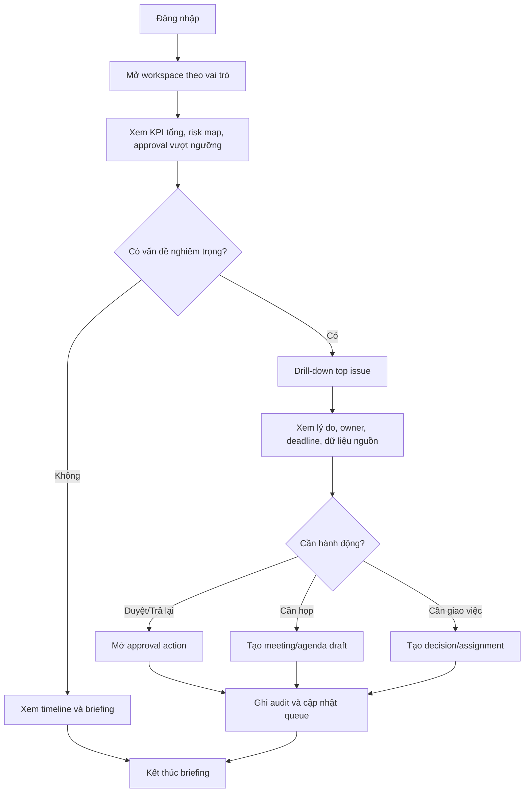
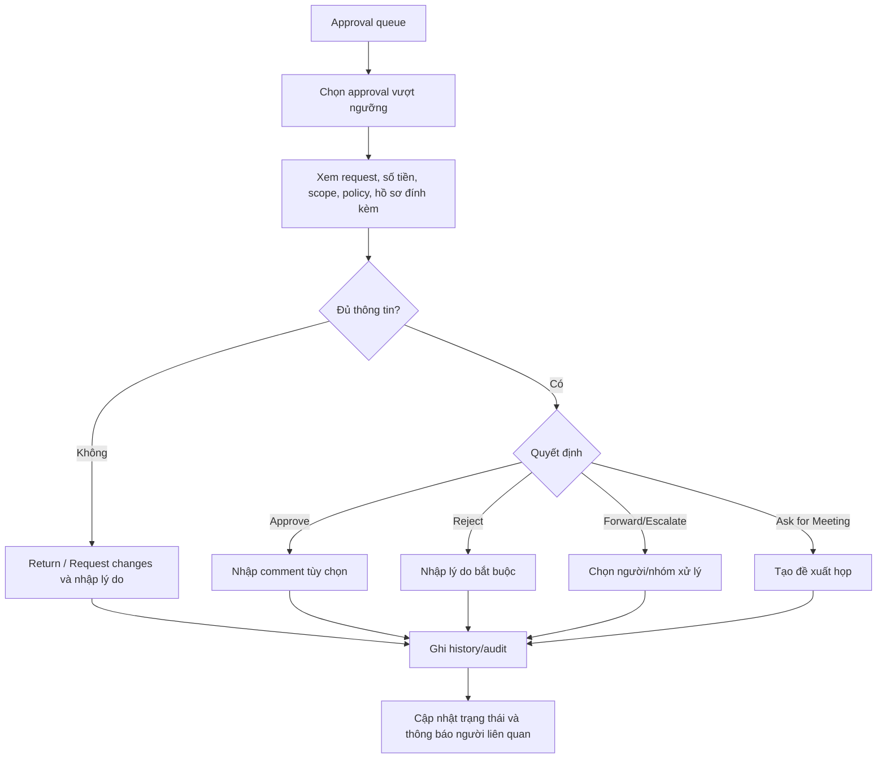
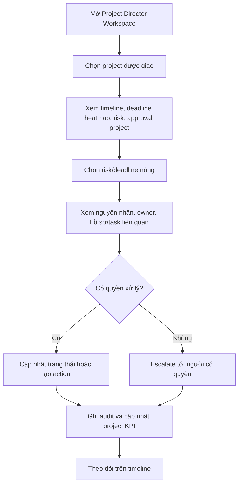
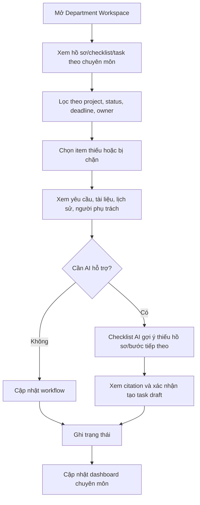
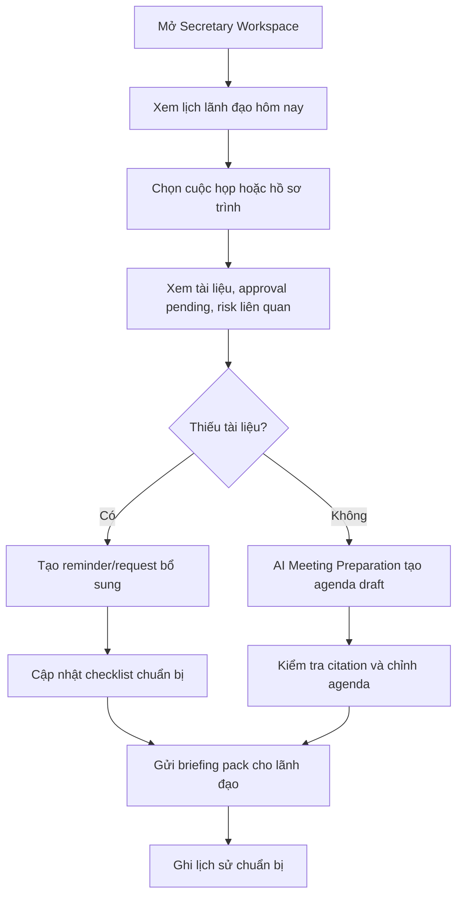

# UX Design Specification green_nest_buider_web

**Author:** Admin
**Date:** 2026-05-23

---

<!-- UX design content will be appended sequentially through collaborative workflow steps -->

## Executive Summary

### Project Vision

GREENNEST BUILDFLOW là hệ thống vận hành dự án cấp tập đoàn, bắt đầu với Trục 1 - Phát triển & Hình thành dự án. UX của Module Lãnh đạo cần giúp lãnh đạo xem nhanh tình trạng danh mục dự án, nhận diện rủi ro, xử lý phê duyệt, ban hành quyết định, giao việc, theo dõi họp và kiểm tra lịch sử điều hành theo đúng phạm vi được phân quyền.

### Target Users

Người dùng chính gồm Chủ tịch / Super Admin, CEO, Phó TGĐ, Giám đốc dự án, Trưởng bộ phận, Thư ký / Trợ lý, Quản trị hệ thống, Quản trị điều hành và Người xem. Trải nghiệm cần role-first, scope-aware và không giả định mọi lãnh đạo nhìn thấy cùng một dữ liệu.

### Key Design Challenges

Thiết kế phải đủ dày cho vận hành hằng ngày nhưng không biến dashboard lãnh đạo thành nơi nhập liệu vi mô. Mọi dữ liệu, module và hành động phải tuân thủ phân quyền role + scope + action. UX cũng cần phân biệt rõ approval, decision, assignment, risk, meeting và audit/history để tránh lẫn lộn nghiệp vụ.

### Design Opportunities

Cơ hội UX chính là tạo một executive operating layer rõ ràng: Morning Briefing để nắm việc đầu ngày, Common Center cho thông tin chung đã lọc quyền, Private Workspace cho phạm vi cá nhân, và drill-down từ KPI/risk/approval tới dữ liệu nguồn. AI nên xuất hiện như hành động ngữ cảnh có citation, trạng thái draft/gợi ý và human confirmation trước mọi thay đổi dữ liệu.

## Core User Experience

### Defining Experience

Trải nghiệm cốt lõi của GREENNEST BUILDFLOW là hệ thống workspace theo vai trò, nơi mỗi người dùng vào đúng bề mặt điều hành tương ứng với quyền hạn và phạm vi công việc của mình.

Vòng lặp chính của người dùng là:

1. Xem tổng quan theo phạm vi được phân quyền.
2. Nhận diện việc quan trọng, rủi ro, approval, deadline hoặc escalation cần xử lý.
3. Drill-down vào dữ liệu nguồn để hiểu nguyên nhân.
4. Thực hiện hành động phù hợp: duyệt, trả lại, chuyển cấp, tạo quyết định, giao việc, tạo họp hoặc xem audit.
5. Theo dõi kết quả qua timeline, history và trạng thái thực hiện.

Trọng tâm UX không phải là nhập liệu vi mô, mà là giúp từng nhóm người dùng nhìn đúng thứ cần nhìn và ra quyết định nhanh hơn.

### Platform Strategy

Sản phẩm là web application responsive.

Desktop là bề mặt làm việc chính cho dashboard, bảng dữ liệu, drill-down, timeline, approval, phân quyền và thao tác điều hành phức tạp.

Mobile cần hỗ trợ responsive đủ tốt cho các tình huống kiểm tra nhanh: xem dashboard, xem approval pending, đọc risk/blocker, mở lịch họp, xem tài liệu trình và cập nhật trạng thái nhẹ. Mobile không phải bề mặt chính để cấu hình phức tạp hoặc xử lý bảng dữ liệu dày.

### Effortless Interactions

Các tương tác cần gần như không cần suy nghĩ:

- Người dùng đăng nhập và vào đúng workspace theo vai trò.
- Chairman thấy ngay toàn cảnh hệ thống, KPI tổng, dòng tiền tổng, risk map, top vấn đề nguy hiểm, dự án đỏ và approval vượt ngưỡng.
- CEO thấy ngay vận hành tổng, tiến độ, resource allocation, performance analytics, approval queue, risk vận hành và escalation.
- Project Director thấy ngay tình trạng project được giao, timeline, cost, approval, risk, task priority và deadline heatmap.
- Department Head thấy ngay hồ sơ chuyên môn, task, workflow, checklist, approval chuyên môn và risk chuyên môn.
- Secretary / Assistant thấy ngay lịch lãnh đạo, hồ sơ trình, tài liệu họp, reminder, task hỗ trợ và approval pending.
- Từ mọi KPI, risk, approval hoặc cảnh báo quan trọng, người dùng có thể drill-down đến dữ liệu nguồn.
- Hành động quan trọng luôn có trạng thái, lý do, người chịu trách nhiệm, deadline và audit trail.

### Critical Success Moments

Khoảnh khắc thành công đầu tiên là khi Chairman hoặc CEO mở workspace và trong 1-2 phút biết chính xác hôm nay cần chú ý điều gì, vấn đề nào nguy hiểm nhất, approval nào vượt ngưỡng, dự án nào đang đỏ và cần drill-down vào đâu.

Với Project Director, khoảnh khắc thành công là nhìn được tình trạng project được giao, rủi ro, deadline, approval và task ưu tiên mà không phải gom dữ liệu từ nhiều nơi.

Với Department Head, khoảnh khắc thành công là quản được checklist/workflow chuyên môn và biết ngay hồ sơ nào thiếu, việc nào chờ xử lý, approval nào đang kẹt.

Với Secretary / Assistant, khoảnh khắc thành công là chuẩn bị được lịch, hồ sơ trình, agenda, tài liệu họp và reminder cho lãnh đạo mà không cần hỏi lại nhiều lần.

### Experience Principles

- Role-first: mỗi vai trò có workspace riêng, không dùng một dashboard chung cho tất cả.
- Scope-aware: mọi số liệu, danh sách, hành động và drill-down phải tuân thủ role + scope + action.
- Executive clarity: bề mặt lãnh đạo ưu tiên tổng quan, rủi ro, quyết định, approval vượt ngưỡng và chiến lược; không đẩy task nhỏ hoặc dữ liệu chuyên môn sâu lên mặc định.
- Dense but readable: giao diện phải khoa học, dễ quét, đủ dày cho vận hành nhưng không rối.
- Actionable dashboard: KPI và cảnh báo phải dẫn đến dữ liệu nguồn hoặc hành động tiếp theo.
- Audit by design: approval, decision, assignment, risk, meeting và phân quyền quan trọng đều phải có lịch sử/audit rõ ràng.
- AI as assistant, not authority: AI hỗ trợ chuẩn bị họp, tóm tắt, gợi ý checklist, agenda, risk hoặc approval insight, nhưng không tự phê duyệt, tự quyết định hoặc tự thay đổi dữ liệu.

## Desired Emotional Response

### Primary Emotional Goals

GREENNEST BUILDFLOW cần tạo cảm giác rõ ràng, có kiểm soát và đáng tin. Người dùng, đặc biệt là lãnh đạo, phải cảm thấy rằng hệ thống đang giúp họ nhìn đúng vấn đề, đúng mức độ nghiêm trọng và đúng phạm vi trách nhiệm.

Cảm xúc chính cần đạt:

- Chairman cảm thấy nắm được toàn hệ thống mà không bị chìm trong chi tiết nhỏ.
- CEO cảm thấy kiểm soát được vận hành, escalation, approval queue và tiến độ tổng.
- Project Director cảm thấy biết rõ dự án đang ở đâu, rủi ro nào cần xử lý và deadline nào đang nóng.
- Department Head cảm thấy workflow chuyên môn có trật tự, hồ sơ/checklist/task không bị thất lạc.
- Secretary / Assistant cảm thấy chuẩn bị họp, hồ sơ trình và reminder cho lãnh đạo dễ hơn, ít phụ thuộc vào hỏi đáp thủ công.

### Emotional Journey Mapping

Khi đăng nhập, người dùng cần thấy ngay workspace phù hợp với vai trò, không phải tự tìm xem mình nên bắt đầu từ đâu.

Trong quá trình sử dụng, giao diện cần tạo cảm giác đang đọc một bảng điều hành có tổ chức: KPI, risk, approval, timeline, task và hồ sơ được phân nhóm rõ, có ưu tiên, có drill-down và có trạng thái.

Sau khi hoàn thành một hành động như duyệt, trả lại, giao việc, tạo meeting hoặc xem risk, người dùng cần cảm thấy hệ thống đã ghi nhận đầy đủ: ai làm, lúc nào, lý do gì, tác động tới record nào và bước tiếp theo là gì.

Khi có lỗi, thiếu quyền hoặc thiếu dữ liệu, hệ thống phải giữ cảm giác kiểm soát bằng thông báo rõ ràng, không gây hoang mang, không để người dùng nghĩ dữ liệu bị mất hoặc thao tác sai.

Khi quay lại sử dụng hằng ngày, người dùng cần cảm thấy hệ thống có nhịp vận hành ổn định: hôm nay có gì mới, việc nào quá hạn, risk nào tăng, approval nào cần xử lý và thay đổi nào đã xảy ra.

### Micro-Emotions

Các micro-emotion quan trọng:

- Confidence thay vì confusion.
- Trust thay vì nghi ngờ số liệu.
- Calm focus thay vì quá tải thông tin.
- Control thay vì cảm giác mất dấu việc.
- Readiness thay vì bị động trước cuộc họp hoặc approval.
- Accountability thay vì không biết ai chịu trách nhiệm.

Những cảm xúc cần tránh:

- Rối vì quá nhiều card và màu sắc.
- Lo lắng vì không biết dữ liệu có theo đúng quyền không.
- Mất niềm tin vì KPI không drill-down được.
- Bực bội vì approval, decision, task và meeting bị trộn lẫn.
- Cảm giác hệ thống chỉ là dashboard tĩnh, không giúp hành động.

### Design Implications

Để tạo cảm giác rõ ràng và kiểm soát, giao diện cần dùng layout có phân cấp mạnh: khu tổng quan, khu cảnh báo ưu tiên, khu danh sách hành động và khu timeline/history.

Để tạo niềm tin, mọi KPI, risk, approval và cảnh báo quan trọng phải có khả năng drill-down đến dữ liệu nguồn, kèm trạng thái, chủ sở hữu, deadline, quyền xem và audit trail khi cần.

Để giảm quá tải, mỗi workspace chỉ hiển thị thông tin phù hợp với vai trò. Chairman không bị đẩy task nhỏ; Project Director không nhìn dữ liệu toàn hệ thống nếu không có scope; Secretary / Assistant chỉ thấy dữ liệu được ủy quyền.

Để tạo cảm giác khoa học, UI cần ưu tiên bảng, timeline, heatmap, status badge có chữ, filter, search và grouping rõ ràng thay vì card trang trí lớn.

Để AI tạo niềm tin, mọi AI output phải được đặt trong ngữ cảnh cụ thể như chuẩn bị họp, tóm tắt approval, gợi ý checklist hoặc phân tích risk; AI luôn là draft/gợi ý và không tự thay người dùng ra quyết định.

### Emotional Design Principles

- Calm command: giao diện tạo cảm giác điều hành bình tĩnh, không gây nhiễu.
- Clarity before decoration: ưu tiên dễ hiểu, dễ quét, dễ so sánh hơn hiệu ứng thị giác.
- Trust through traceability: số liệu và hành động quan trọng phải truy ngược được nguồn.
- Role confidence: người dùng cảm thấy workspace này được thiết kế đúng cho vai trò của họ.
- Controlled urgency: việc khẩn phải nổi bật, nhưng không làm toàn bộ giao diện trở nên báo động liên tục.
- Human authority: hệ thống và AI hỗ trợ quyết định, nhưng quyền quyết định cuối cùng luôn thuộc con người có thẩm quyền.

## UX Pattern Analysis & Inspiration

### Inspiring Products Analysis

Nguồn cảm hứng chính:

- Power BI / Tableau: mạnh ở dashboard điều hành, KPI, drill-down, filter, biểu đồ và khả năng truy ngược dữ liệu.
- Jira / Linear: mạnh ở trạng thái công việc, priority, workflow, ownership, deadline và luồng xử lý issue rõ ràng.
- Salesforce / Microsoft Dynamics: mạnh ở workspace theo vai trò, record detail, activity timeline, permission-aware navigation và enterprise workflow.
- SAP Fiori: mạnh ở nguyên tắc enterprise UI, role-based launchpad, object page, list report và action có kiểm soát.
- Notion / Airtable: mạnh ở cách tổ chức dữ liệu linh hoạt, bảng/list/detail dễ đọc, nhưng cần tiết chế để không biến hệ thống thành công cụ ghi chú tự do.

### Transferable UX Patterns

Các pattern nên áp dụng:

- Role-based workspace: mỗi vai trò có dashboard riêng, dữ liệu riêng, action riêng.
- Executive dashboard with drill-down: KPI, risk, approval và cảnh báo phải mở được dữ liệu nguồn.
- List-detail pattern: danh sách vận hành bên trái hoặc vùng chính, record detail/timeline/action ở vùng phụ hoặc trang chi tiết.
- Priority queue: approval, risk, deadline và escalation cần xếp theo mức độ nghiêm trọng thay vì chỉ theo thời gian.
- Status badge có chữ: mọi trạng thái quan trọng dùng badge có text, không chỉ dùng màu.
- Timeline/activity trail: approval, decision, meeting, risk và permission change cần có lịch sử rõ ràng.
- Filter-first data table: bảng dày phải có search, filter, grouping, sort và saved view nếu cần.
- AI contextual action: AI xuất hiện tại đúng ngữ cảnh như chuẩn bị họp, tóm tắt risk, kiểm checklist, gợi ý agenda, không là chatbot chung thay toàn bộ UI.

### Anti-Patterns to Avoid

Các pattern cần tránh:

- Dashboard dạng nhiều card rời rạc nhưng không dẫn tới hành động.
- Hero section, banner lớn, hiệu ứng trang trí hoặc layout marketing trong app vận hành.
- Một dashboard dùng chung cho mọi vai trò.
- Chỉ ẩn dữ liệu ở frontend thay vì enforce permission từ service/server.
- Dùng màu đỏ/vàng/xanh mà không có nhãn, lý do và dữ liệu nguồn.
- Trộn approval, decision, task, meeting và risk vào cùng một danh sách không phân loại.
- AI chat chung không biết scope, không có citation, không có trạng thái draft/gợi ý.
- Mobile ép hiển thị bảng rộng mà không có layout thay thế.

### Design Inspiration Strategy

Áp dụng hướng thiết kế enterprise command center: rõ vai trò, rõ phạm vi, rõ ưu tiên, rõ hành động tiếp theo.

Adopt:

- Power BI/Tableau cho KPI, dashboard, filter và drill-down.
- Jira/Linear cho queue ưu tiên, trạng thái, owner, deadline và workflow.
- Salesforce/Dynamics cho record detail, activity timeline và workspace theo vai trò.
- SAP Fiori cho tính kỷ luật của enterprise UI: list report, object page, action có kiểm soát.

Adapt:

- Notion/Airtable chỉ lấy sự linh hoạt trong list/table/view, không lấy phong cách tự do quá mức.
- AI chỉ dùng như lớp hỗ trợ trong workflow, không thay thế cấu trúc điều hành chính.

Avoid:

- Giao diện cũ nếu đang thiên về dashboard tĩnh, card rời rạc, thiếu phân quyền theo vai trò hoặc thiếu drill-down.
- Giao diện quá đẹp mắt nhưng không giúp lãnh đạo biết việc gì cần xử lý ngay.

## Design System Foundation

### 1.1 Design System Choice

GREENNEST BUILDFLOW sẽ dùng hướng Themeable System dựa trên Tailwind CSS + shadcn/ui + Radix primitives + lucide-react.

Đây là nền phù hợp vì repo hiện tại đã có sẵn cấu hình shadcn/ui, Tailwind, component alias và icon library. Design system sẽ không phụ thuộc vào một bộ UI enterprise nặng như Ant Design hoặc MUI, mà mở rộng từ nền hiện tại thành bộ pattern riêng cho ứng dụng vận hành cấp tập đoàn.

### Rationale for Selection

Lựa chọn này phù hợp vì sản phẩm cần:

- Giao diện enterprise rõ ràng, dày thông tin, dễ quét.
- Tốc độ triển khai nhanh trên nền code hiện có.
- Tùy biến cao cho workspace theo vai trò.
- Component đủ kiểm soát để enforce permission-aware UI.
- Responsive web tốt mà không cần phát triển mobile app riêng.
- Dễ tạo các pattern riêng như executive dashboard, risk map, approval queue, timeline, checklist và AI action panel.

Không chọn custom design system hoàn toàn từ đầu vì chi phí cao và không cần thiết cho giai đoạn hiện tại.

Không chọn Ant Design/MUI làm nền chính vì sẽ tạo thêm dependency lớn, dễ lệch khỏi cấu trúc shadcn/Tailwind hiện có và có nguy cơ làm giao diện giống generic admin template.

### Implementation Approach

Thiết kế sẽ xây trên các lớp sau:

- Base UI: button, input, select, dialog, popover, tabs, badge, table, tooltip, sheet, dropdown.
- Layout shell: sidebar desktop, mobile drawer, top header, role workspace switcher, page shell.
- Enterprise patterns: KPI strip, executive dashboard grid, priority queue, risk map, approval queue, timeline, audit trail, list-detail page, object detail page.
- Role workspace patterns: Chairman Workspace, CEO Workspace, Project Director Workspace, Department Head Workspace, Secretary / Assistant Workspace.
- AI patterns: contextual AI panel, AI summary draft, AI meeting preparation, AI agenda builder, AI checklist assistant, AI action proposal review.

Các component nên được thiết kế theo hướng reusable pattern, không chỉ là từng card riêng lẻ. Dashboard không được là tập hợp card tĩnh; mỗi khối dữ liệu cần có trạng thái, ngữ cảnh, drill-down hoặc hành động tiếp theo.

### Customization Strategy

Visual direction cần đi theo hướng khoa học, rõ ràng, professional và Vietnamese-first.

Nguyên tắc tùy biến:

- Dùng typography nhỏ gọn, phân cấp rõ, phù hợp dashboard vận hành.
- Dùng spacing chặt nhưng có nhịp, tránh giao diện quá thưa hoặc quá nhiều card lớn.
- Dùng màu trung tính làm nền, màu xanh GreenNest làm primary vừa phải, đỏ/vàng/xanh lá cho trạng thái, không dùng một theme đơn sắc slate/dark-blue.
- Badge trạng thái luôn có chữ, không chỉ dựa vào màu.
- Icon dùng lucide-react cho action và navigation.
- Tables, lists, timelines và heatmaps là bề mặt chính cho vận hành.
- Cards chỉ dùng cho nhóm thông tin thật sự cần đóng khung, không lồng card trong card.
- Mobile dùng layout xếp lớp và danh sách ưu tiên thay vì ép bảng rộng.
- AI component phải hiển thị như công cụ hỗ trợ theo ngữ cảnh, không thay thế toàn bộ navigation hoặc workflow.

## 2. Core User Experience

### 2.1 Defining Experience

Defining experience của GREENNEST BUILDFLOW là Role Workspace Command Loop:

```text
Vào workspace theo vai trò
-> thấy ưu tiên quan trọng nhất
-> drill-down đến dữ liệu nguồn
-> xử lý hoặc giao hành động
-> hệ thống ghi nhận lịch sử/audit
-> quay lại dashboard với trạng thái đã cập nhật
```

Nếu làm đúng vòng lặp này, sản phẩm sẽ khác giao diện cũ: không còn là dashboard tĩnh hoặc tập hợp card rời rạc, mà trở thành bề mặt điều hành thật sự.

### 2.2 User Mental Model

Người dùng mang theo mental model từ cách điều hành thực tế:

- Chairman nghĩ theo toàn hệ thống, chiến lược, dòng tiền, rủi ro lớn, bổ nhiệm và phân quyền cấp cao.
- CEO nghĩ theo vận hành tổng, tiến độ, nguồn lực, KPI, approval queue và escalation.
- Project Director nghĩ theo dự án được giao, timeline, chi phí, task priority, approval và risk project.
- Department Head nghĩ theo workflow chuyên môn, checklist, hồ sơ, task và approval chuyên môn.
- Secretary / Assistant nghĩ theo lịch lãnh đạo, hồ sơ trình, tài liệu họp, reminder và chuẩn bị nội dung.

UX phải đi theo mental model này thay vì ép mọi người dùng vào cùng một dashboard.

### 2.3 Success Criteria

Core experience được xem là thành công khi:

- Người dùng vào app và thấy đúng workspace của mình.
- Trong 1-2 phút, Chairman/CEO biết vấn đề quan trọng nhất hôm nay.
- KPI, risk, approval, deadline và escalation đều drill-down được.
- Mỗi cảnh báo quan trọng có lý do, owner, deadline, trạng thái và next action.
- Người dùng không phải đoán dữ liệu này thuộc scope nào hoặc có được phép xem không.
- Sau một hành động quan trọng, hệ thống cập nhật trạng thái và ghi audit/history rõ ràng.
- Mobile vẫn xem được ưu tiên chính, approval pending, risk và lịch họp mà không vỡ layout.

### 2.4 Novel UX Patterns

Sản phẩm nên dùng pattern quen thuộc, không cần phát minh interaction lạ:

- Dashboard + drill-down từ Power BI/Tableau.
- Queue ưu tiên từ Jira/Linear.
- Record detail + activity timeline từ Salesforce/Dynamics.
- Role-based workspace từ SAP Fiori.
- Contextual AI action panel thay vì chatbot chung.

Điểm khác biệt không nằm ở interaction mới lạ, mà nằm ở cách kết hợp các pattern enterprise thành workspace điều hành đúng vai trò, đúng scope và có thể hành động ngay.

### 2.5 Experience Mechanics

#### Initiation

Người dùng đăng nhập và được đưa vào workspace mặc định theo vai trò chính. Nếu có nhiều role/scope, UI cho phép chuyển workspace hoặc scope rõ ràng.

#### Interaction

Người dùng đọc các vùng ưu tiên:

- KPI tổng hoặc KPI theo scope.
- Risk map hoặc risk queue.
- Approval queue.
- Deadline/escalation.
- Timeline hoặc activity stream.
- AI hỗ trợ theo ngữ cảnh nếu cần.

Người dùng chọn một item để drill-down, xem dữ liệu nguồn, record liên quan, lịch sử, người phụ trách và action khả dụng.

#### Feedback

Hệ thống phản hồi bằng:

- Badge trạng thái có chữ.
- Lý do risk/overdue/escalation.
- Inline validation khi action thiếu dữ liệu.
- Confirmation rõ ràng trước mutation quan trọng.
- Audit/history sau khi action hoàn tất.

#### Completion

Một action hoàn tất khi:

- Trạng thái record được cập nhật.
- Người chịu trách nhiệm và deadline tiếp theo rõ ràng.
- Audit log được ghi.
- Dashboard/queue phản ánh trạng thái mới.
- Người dùng biết bước tiếp theo là theo dõi, chờ phản hồi, hoặc xử lý item kế tiếp.

## Visual Design Foundation

### Color System

Hệ màu cần tạo cảm giác vận hành chuyên nghiệp, rõ ràng và đáng tin. Không dùng giao diện quá tối, không dùng palette một màu, không dùng gradient/trang trí marketing.

Bảng màu đề xuất:

- Background chính: `#F8FAFC` hoặc `#F9FAFB` để giữ nền sáng, sạch.
- Surface/card/table: `#FFFFFF`.
- Border/divider: `#E5E7EB`.
- Text chính: `#111827`.
- Text phụ: `#4B5563`.
- GreenNest primary: `#166534` hoặc `#15803D`, dùng cho primary action, active navigation, điểm nhấn thương hiệu.
- Info: `#0284C7`, dùng cho thông tin trung tính, AI insight, system notice.
- Warning: `#D97706`, dùng cho sắp quá hạn, cần chú ý.
- Danger: `#DC2626`, dùng cho overdue, blocked, rejected, risk nghiêm trọng.
- Success: `#16A34A`, dùng cho approved, complete, healthy.
- Neutral: `#6B7280`, dùng cho draft, archived, not started.

Nguyên tắc dùng màu:

- Màu không thay thế chữ. Badge trạng thái luôn có label.
- Risk đỏ/vàng/xanh phải có lý do và drill-down.
- Primary green không dùng tràn lan toàn giao diện; chỉ dùng cho nhận diện và hành động chính.
- Financial, risk, approval, AI và audit nên có màu/biểu tượng phân biệt nhưng vẫn nằm trong hệ thống semantic chung.

### Typography System

Typography cần nhỏ gọn, rõ cấp bậc, phù hợp dashboard dày thông tin.

Đề xuất:

- Font chính: dùng system font stack hiện tại để tối ưu performance và hiển thị tốt tiếng Việt.
- H1/page title: 24-28px, dùng cho tiêu đề trang/workspace.
- H2/section title: 18-20px, dùng cho vùng chính.
- H3/panel title: 15-16px, dùng cho panel/table section.
- Body: 14px.
- Metadata/table/helper text: 12-13px.
- Line-height: 1.4-1.6 tùy mật độ.
- Không dùng hero-scale typography bên trong dashboard/panel.
- Không dùng letter-spacing âm.

Nguyên tắc:

- Số KPI có thể lớn hơn text thường nhưng không được lấn át ngữ cảnh.
- Table và queue cần dễ đọc trong thời gian dài.
- Text tiếng Việt phải đủ rộng, tránh nút hoặc badge bị vỡ dòng xấu.

### Spacing & Layout Foundation

Layout cần dense but readable: đủ thông tin để điều hành, nhưng không rối.

Nền tảng spacing:

- Base unit: 4px.
- Component rhythm chính: 8px, 12px, 16px, 24px.
- Card/panel radius: tối đa 8px.
- Không lồng card trong card.
- Không dùng section nổi như card lớn nếu không cần.
- Dashboard dùng grid rõ ràng, ưu tiên alignment và grouping hơn trang trí.

Desktop layout:

- Sidebar cố định cho navigation theo quyền.
- Header chứa workspace/scope switcher, search, notification và user actions.
- Main content chia thành vùng ưu tiên: KPI strip, risk/approval/action queue, timeline/detail.
- Với trang detail, dùng pattern header summary + tabs/sections + activity/audit.

Mobile layout:

- Sidebar chuyển thành drawer.
- KPI/risk/approval chuyển thành stacked priority list.
- Table chuyển thành list row/card compact có key fields.
- Không ép người dùng thao tác bảng rộng trên mobile.

### Accessibility Considerations

Yêu cầu accessibility:

- Độ tương phản text/nền đạt WCAG AA ở các trạng thái chính.
- Không truyền đạt trạng thái chỉ bằng màu.
- Button/action quan trọng có label rõ.
- Focus state phải thấy được khi dùng keyboard.
- Modal/dialog phải có title, mô tả và escape/close rõ.
- Error/permission denial phải giải thích hành động nào bị chặn và vì sao.
- Dashboard phải giữ được ý nghĩa khi người dùng không phân biệt tốt đỏ/vàng/xanh.

## Design Direction Decision

### Design Directions Explored

Đã tạo và so sánh 6 hướng thiết kế trong `ux-design-directions.html`:

1. Executive Command Center - workspace điều hành tổng hợp cho Chairman/CEO.
2. Operations Control Room - workspace vận hành tổng cho CEO.
3. Project War Room - workspace dự án cho Project Director.
4. Department Workflow Board - workspace chuyên môn cho Department Head.
5. Secretary Briefing Desk - workspace hỗ trợ lãnh đạo cho Secretary / Assistant.
6. Strategic Board View - chế độ review chiến lược cấp cao cho Chairman.

### Chosen Direction

Hướng được chọn là Executive Command Center làm design direction nền.

Các workspace còn lại là biến thể theo vai trò:

- Chairman Workspace: Executive Command Center + Strategic Board View.
- CEO Workspace: Executive Command Center + Operations Control Room.
- Project Director Workspace: Project War Room.
- Department Head Workspace: Department Workflow Board.
- Secretary / Assistant Workspace: Secretary Briefing Desk.

### Design Rationale

Executive Command Center phù hợp nhất vì cân bằng được các yêu cầu chính:

- Dễ nhìn, khoa học, không trang trí thừa.
- Đặt KPI, risk, approval, escalation, timeline và AI copilot vào cùng một bề mặt điều hành.
- Hỗ trợ drill-down từ cảnh báo/KPI đến dữ liệu nguồn.
- Phù hợp với requirement hiện tại hơn giao diện cũ dạng dashboard tĩnh hoặc card rời rạc.
- Dễ mở rộng thành nhiều workspace theo vai trò mà không phá cấu trúc chung.

Strategic Board View chỉ nên là chế độ phụ cho Chairman khi review chiến lược, bổ nhiệm, phân quyền cấp cao hoặc quyết định lớn. Không nên dùng nó làm workspace mặc định duy nhất vì có thể thiếu nhịp vận hành hằng ngày.

### Implementation Approach

Triển khai UI mới theo thứ tự:

1. Xây lại layout shell: sidebar permission-aware, topbar có workspace/scope switcher, content area responsive.
2. Tạo pattern Executive Command Center: KPI strip, top risk/issues, approval queue, risk map, executive timeline, AI copilot panel.
3. Tạo biến thể role workspace bằng cùng component nền nhưng đổi dữ liệu, priority và action.
4. Migrate giao diện cũ sang cấu trúc mới, loại bỏ card tĩnh không có drill-down/action.
5. Đảm bảo mỗi KPI/risk/approval/decision có owner, status, reason, deadline, next action và audit/history khi phù hợp.

## User Journey Flows

### 1. Chairman / CEO Morning Command Loop

Mục tiêu: lãnh đạo mở workspace và trong 1-2 phút biết việc nào cần xử lý trước.



### 2. Approval Vượt Ngưỡng

Mục tiêu: người có thẩm quyền xử lý approval quan trọng với đủ ngữ cảnh, lý do và audit.



### 3. Project Director Risk / Deadline Flow

Mục tiêu: Giám đốc dự án nhìn được project đang kẹt ở đâu và xử lý đúng người đúng hạn.



### 4. Department Head Checklist / Workflow Flow

Mục tiêu: trưởng bộ phận quản được hồ sơ, checklist, approval chuyên môn và risk chuyên môn.



### 5. Secretary / Assistant Meeting Preparation Flow

Mục tiêu: thư ký/trợ lý chuẩn bị lịch, hồ sơ trình, agenda và summary trong phạm vi được ủy quyền.



### Journey Patterns

Các pattern cần chuẩn hóa:

- Entry theo workspace vai trò, không bắt người dùng tự chọn từ dashboard chung.
- Mọi journey bắt đầu bằng priority queue hoặc dashboard theo scope.
- Drill-down luôn hiển thị lý do, owner, deadline, trạng thái, dữ liệu nguồn và action khả dụng.
- Mutation quan trọng luôn có confirmation, validation và audit/history.
- AI luôn ở trạng thái draft/gợi ý, có citation và cần người dùng xác nhận.

### Flow Optimization Principles

- Đưa việc khẩn lên trước, nhưng vẫn cho người dùng kiểm chứng nguồn.
- Giảm số bước từ dashboard tới action chính.
- Không yêu cầu lãnh đạo xử lý task nhỏ hoặc dữ liệu chuyên môn sâu mặc định.
- Không hiển thị action người dùng không có quyền.
- Khi thiếu quyền, giải thích rõ và gợi ý người/nhóm có thể xử lý.
- Sau mỗi action, cập nhật queue/timeline để người dùng thấy hệ thống đã ghi nhận.

## Component Strategy

### Design System Components

Nền hiện tại:

- Tailwind CSS.
- shadcn/ui configuration.
- Radix primitive dependency.
- lucide-react icon library.
- Component foundation hiện có: Button.

Foundation components cần bổ sung hoặc chuẩn hóa trước khi làm workspace mới:

- Badge.
- Card/Panel.
- Table.
- Tabs.
- Dialog/Alert Dialog.
- Sheet/Drawer.
- Dropdown Menu.
- Select.
- Input/Search.
- Tooltip.
- Separator.
- Scroll Area.
- Skeleton/Loading.
- Toast/Inline feedback.

Các foundation component này phải dùng token đã chốt: màu semantic, radius tối đa 8px, spacing 4/8/12/16/24px, focus state rõ, text tiếng Việt không bị vỡ.

### Custom Components

#### AppShell / PermissionAwareShell

**Purpose:** Bố cục ứng dụng chính với sidebar, topbar, workspace/scope switcher và vùng nội dung.

**Usage:** Dùng cho toàn bộ app sau đăng nhập.

**Anatomy:** Sidebar permission-aware, topbar, breadcrumb/context, workspace selector, scope selector, content container.

**Navigation hierarchy:** Sidebar phải phân biệt 3 tầng: `Tổng quan Trục 1` / Command Center entry, `Module 1 - Lãnh đạo` workspace, và `Quản trị Chủ tịch` / BO Settings. Chủ tịch có thể thấy quyền quản trị, nhưng default daily workspace phải là bề mặt điều hành theo scope, không phải admin/settings.

**States:** desktop, mobile drawer, collapsed, unauthorized, loading session.

**Accessibility:** keyboard navigation, focus visible, drawer có aria-label và close rõ.

#### WorkspaceHeader

**Purpose:** Cho người dùng biết đang ở workspace nào, scope nào, vai trò nào.

**Content:** Tên workspace, role, scope, thời gian cập nhật, primary action nếu có quyền.

**Actions:** đổi workspace, đổi scope, refresh data, mở filter.

**Variants:** Chairman, CEO, Project Director, Department Head, Secretary / Assistant.

#### KPI Strip

**Purpose:** Hiển thị KPI trọng yếu theo scope.

**Content:** label, value, trend, status, quyền dữ liệu, link drill-down.

**States:** normal, warning, danger, no permission, loading, empty.

**Interaction:** click KPI để mở filtered source data.

#### Priority Queue

**Purpose:** Danh sách việc cần xử lý theo mức độ ưu tiên.

**Content:** title, type, severity, owner, deadline, reason, next action.

**Variants:** approval queue, risk queue, escalation queue, task priority queue.

**Interaction:** mở detail, filter, sort, quick action nếu có quyền.

#### Risk Map / Deadline Heatmap

**Purpose:** Hiển thị mức độ rủi ro hoặc áp lực deadline.

**Content:** category, count, severity, affected projects, drill-down.

**States:** green/yellow/red/critical với label rõ.

**Accessibility:** không phụ thuộc màu; mỗi ô có text, tooltip/label.

#### Approval Action Panel

**Purpose:** Xử lý approval với đủ ngữ cảnh.

**Content:** request summary, policy, amount, attachments, history, decision actions.

**Actions:** approve, reject, return/request changes, forward/escalate, ask for meeting, hold.

**Validation:** reject/return bắt buộc lý do; approve comment tùy chọn.

#### Record Drilldown Panel

**Purpose:** Mở dữ liệu nguồn từ KPI/risk/approval mà không làm mất ngữ cảnh dashboard.

**Content:** summary, related records, owner, status, deadline, timeline, audit.

**Variants:** side panel desktop, full-screen sheet mobile.

#### Activity Timeline / Audit Trail

**Purpose:** Cho thấy ai làm gì, lúc nào, thay đổi gì, lý do gì.

**Content:** actor, action, timestamp, previous/new state, comment, attachment.

**Usage:** approval, decision, risk, meeting, permission changes.

#### Contextual AI Panel

**Purpose:** AI hỗ trợ trong đúng ngữ cảnh, không thay thế workflow.

**Variants:** Executive AI Copilot, Checklist AI, AI Meeting Preparation, AI Agenda Builder, AI Summary Assistant.

**Rules:** luôn là draft/gợi ý, có citation, có trạng thái proposed/accepted/rejected/executed/failed nếu sinh action.

### Component Implementation Strategy

Ưu tiên xây component theo 3 lớp:

1. Foundation UI: badge, panel, table, tabs, dialog, sheet, dropdown, input, select, tooltip, skeleton.
2. Enterprise patterns: KPI Strip, Priority Queue, Risk Map, Approval Action Panel, Record Drilldown Panel, Timeline/Audit Trail.
3. Role workspace compositions: Chairman Workspace, CEO Workspace, Project Director Workspace, Department Head Workspace, Secretary / Assistant Workspace.

Không tạo mỗi workspace như một trang hardcode riêng. Workspace nên là composition từ cùng bộ pattern, thay data source, permission, priority và action theo role/scope.

Component phải nhận dữ liệu có cấu trúc từ service/repository, không hardcode số liệu trong UI.

### Implementation Roadmap

Phase 1 - UI Foundation:

- Badge.
- Panel/Card.
- Table.
- Dialog/Alert Dialog.
- Sheet/Drawer.
- Tabs.
- Input/Search.
- Select/Dropdown.
- Tooltip.
- Skeleton/Empty/Error/Unauthorized states.

Phase 2 - Enterprise Dashboard Patterns:

- AppShell / PermissionAwareShell.
- WorkspaceHeader.
- KPI Strip.
- Priority Queue.
- Risk Map / Deadline Heatmap.
- Activity Timeline / Audit Trail.
- Record Drilldown Panel.

Phase 3 - Workflow Action Components:

- Approval Action Panel.
- Decision/Assignment Panel.
- Meeting Preparation Panel.
- Checklist Workflow Panel.
- Contextual AI Panel.

Phase 4 - Role Workspace Assembly:

- Chairman Workspace.
- CEO Workspace.
- Project Director Workspace.
- Department Head Workspace.
- Secretary / Assistant Workspace.

Phase 5 - Responsive and QA:

- Mobile drawer and stacked priority layout.
- Table-to-list responsive behavior.
- Keyboard/focus checks.
- Permission/403 states.
- Loading/empty/error states.
- Visual regression or screenshot review for key workspaces.

## UX Consistency Patterns

### Button Hierarchy

Button hierarchy phải giúp người dùng biết hành động nào là chính, hành động nào là phụ, hành động nào nguy hiểm.

**Primary action**

- Dùng cho hành động chính của màn hình hoặc panel.
- Ví dụ: `Duyệt`, `Tạo cuộc họp`, `Tạo quyết định`, `Lưu thay đổi`.
- Mỗi panel/action area chỉ nên có một primary action nổi bật.
- Màu primary dùng GreenNest green.

**Secondary action**

- Dùng cho hành động phụ.
- Ví dụ: `Xem nguồn`, `Mở chi tiết`, `Tải tài liệu`, `Lưu nháp`.

**Destructive action**

- Dùng cho từ chối, hủy, reject, xóa hoặc hành động làm mất hiệu lực record.
- Phải có confirmation nếu tác động quan trọng.
- Reject/Return phải yêu cầu lý do khi policy yêu cầu.

**Disabled / permission-denied action**

- Không hiển thị action nếu người dùng hoàn toàn không có quyền.
- Nếu action cần giải thích nghiệp vụ, có thể hiển thị disabled kèm tooltip/lý do: `Bạn không có quyền duyệt approval này`.

### Feedback Patterns

Feedback phải giúp người dùng tin rằng hệ thống đã ghi nhận trạng thái.

**Success**

- Hiển thị sau khi action hoàn tất.
- Nêu rõ record nào đã đổi trạng thái và bước tiếp theo là gì.
- Ví dụ: `Approval đã được duyệt. Quyết định đã được ghi vào audit log.`

**Warning**

- Dùng cho sắp quá hạn, thiếu dữ liệu, policy chưa đủ điều kiện.
- Warning không được chặn thao tác nếu vẫn hợp lệ.

**Error**

- Dùng khi validation fail, permission fail, service fail.
- Error message phải nói rõ điều gì sai và cách khắc phục.
- Không dùng thông báo chung chung kiểu `Có lỗi xảy ra` nếu có thể cung cấp ngữ cảnh.

**Permission / 403**

- Với direct URL access, trả 403 rõ ràng.
- Trong UI, giải thích người dùng thiếu quyền gì hoặc scope nào nếu phù hợp.
- Không render dữ liệu rồi mới ẩn.

### Form Patterns

Forms trong app phải ngắn gọn, có validation và giữ ngữ cảnh.

**General form**

- Label tiếng Việt rõ.
- Required fields có dấu hiệu rõ.
- Inline validation gần field.
- Giữ input khi validation fail.
- Primary submit nằm cuối form hoặc trong sticky action area nếu form dài.

**Approval form**

- Approve: comment tùy chọn.
- Reject: lý do bắt buộc.
- Return / Request changes: lý do và yêu cầu chỉnh sửa bắt buộc.
- Forward / Escalate: chọn người/nhóm nhận và comment khuyến nghị.
- Ask for Meeting: chọn meeting type, agenda draft, participant scope.

**AI action proposal form**

- Hiển thị preview trước mutation.
- Liệt kê record bị ảnh hưởng, field thay đổi, permission cần có.
- Confirm button phải explicit, ví dụ `Xác nhận tạo task`.
- Reject proposal cho phép nhập lý do tùy chọn và không đổi business record.

### Navigation Patterns

Navigation phải permission-aware và role-first.

**Sidebar**

- Desktop dùng sidebar cố định.
- Chỉ hiển thị module/workspace người dùng có quyền truy cập.
- Workspace theo vai trò nằm gần đầu sidebar.

**Topbar**

- Hiển thị workspace hiện tại, scope selector, search, notification và user menu.
- Nếu người dùng có nhiều role/scope, selector phải rõ nhưng không chiếm quá nhiều diện tích.

**Mobile**

- Sidebar chuyển thành drawer.
- Topbar ưu tiên workspace, search và menu.
- Các bảng dày chuyển thành list compact.

**Breadcrumb / context**

- Detail pages phải cho biết record thuộc organization, project, axis/module nào.
- Drill-down panel phải giữ link quay lại dashboard/queue ban đầu.

### Drill-Down Patterns

Mọi KPI, risk, approval, deadline hoặc alert quan trọng phải có đường drill-down.

**Drill-down bắt buộc hiển thị:**

- Tiêu đề record.
- Loại record.
- Scope.
- Owner.
- Deadline.
- Trạng thái.
- Lý do bị cảnh báo hoặc bị chặn.
- Dữ liệu nguồn hoặc linked records.
- Action khả dụng theo quyền.
- Timeline/audit nếu có.

**Desktop**

- Dùng side panel hoặc detail page tùy độ phức tạp.
- Với quick review, side panel là mặc định tốt.

**Mobile**

- Dùng full-screen sheet hoặc detail page.
- Không ép layout 2 cột.

### Search and Filtering Patterns

Search/filter phải hỗ trợ dữ liệu vận hành lớn.

- Search theo tên project, approval, hồ sơ, owner, mã record.
- Filter theo status, severity, project, owner, deadline, module, scope.
- Bảng/list quan trọng phải có sort.
- Filter active phải hiển thị rõ và xóa được.
- Saved view có thể bổ sung sau nếu danh sách lớn.

### Loading, Empty, Error and Unauthorized States

**Loading**

- Dùng skeleton cho dashboard/panel/table.
- Không layout shift mạnh khi data load xong.

**Empty**

- Empty state phải nói rõ không có gì trong scope hiện tại hay do filter.
- Nếu có quyền, hiển thị next action phù hợp.
- Nếu không có quyền, không gợi ý action không làm được.

**Error**

- Có retry nếu lỗi tạm thời.
- Có link về dashboard/workspace nếu lỗi record không tồn tại hoặc không truy cập được.

**Unauthorized**

- Không hiển thị dữ liệu nhạy cảm.
- Nêu rõ người dùng không có quyền hoặc không thuộc scope.
- Gợi ý liên hệ quản trị/phụ trách nếu phù hợp.

### AI UX Patterns

AI phải là contextual assistant.

- AI panel nằm trong đúng workspace hoặc record context.
- AI output luôn có trạng thái: draft/gợi ý/proposed.
- AI answer cần citation với internal record hoặc knowledge item.
- AI không tự approve, reject, tạo blocker chính thức hoặc publish biên bản.
- Nếu AI đề xuất mutation, phải đi qua action proposal preview và human confirmation.
- Nếu thiếu quyền, AI không được truy xuất hoặc hiển thị dữ liệu ngoài scope.

## Responsive Design & Accessibility

### Responsive Strategy

GREENNEST BUILDFLOW là web application responsive với desktop là bề mặt làm việc chính.

**Desktop**

Desktop phải tận dụng không gian màn hình cho:

- Sidebar permission-aware.
- Topbar có workspace/scope switcher.
- KPI strip.
- Multi-column dashboard.
- Priority queue.
- Risk map / deadline heatmap.
- Side drill-down panel.
- Timeline / audit trail.
- Data table có filter/sort.

Desktop là nơi xử lý các flow phức tạp như approval, phân quyền, cấu hình policy, review audit, quản lý checklist và phân tích nhiều dự án.

**Tablet**

Tablet dùng layout giản lược:

- Sidebar có thể collapse hoặc chuyển thành drawer.
- Dashboard giảm số cột.
- Side panel có thể chuyển thành sheet.
- Table ưu tiên column quan trọng, các field phụ đưa vào expanded row/detail.
- Touch target phải đủ lớn cho thao tác bằng tay.

**Mobile**

Mobile hỗ trợ review nhanh và cập nhật nhẹ:

- Xem workspace summary.
- Xem KPI/risk/approval pending.
- Mở lịch họp.
- Đọc tài liệu trình.
- Xem alert/escalation.
- Thực hiện action đơn giản nếu đủ quyền và form không phức tạp.

Mobile không phải nơi chính cho:

- Bảng dữ liệu rộng.
- Cấu hình permission/policy phức tạp.
- Review audit nhiều lớp.
- Dashboard multi-column.
- Phân tích tài chính/risk chuyên sâu.

### Breakpoint Strategy

Dùng breakpoint theo Tailwind mặc định để phù hợp stack hiện tại:

- `sm`: 640px.
- `md`: 768px.
- `lg`: 1024px.
- `xl`: 1280px.
- `2xl`: 1536px.

Chiến lược layout:

- `< 768px`: mobile stacked layout, drawer navigation, list compact thay table.
- `768px - 1023px`: tablet layout, 1-2 cột, drawer/collapsed nav.
- `1024px - 1279px`: desktop cơ bản, sidebar + content, dashboard 2-3 cột.
- `>= 1280px`: desktop đầy đủ, dashboard 3-4 cột, side drill-down panel.
- `>= 1536px`: executive command center có thể hiển thị KPI, queue, risk map và timeline cùng lúc.

Không scale font theo viewport width. Dùng responsive layout, không dùng viewport-based typography.

### Accessibility Strategy

Mục tiêu accessibility: WCAG 2.1 AA cho các màn hình chính.

Yêu cầu:

- Contrast text đạt tối thiểu 4.5:1 cho text thường.
- Không dùng màu làm tín hiệu duy nhất; badge phải có chữ.
- Focus state phải rõ cho keyboard users.
- Tất cả button/icon button có accessible name.
- Dialog/sheet có title, description, focus trap và close rõ.
- Form field có label, error message và mô tả nếu cần.
- Table có header semantic.
- Loading/empty/error/unauthorized state có text rõ.
- Touch target mobile tối thiểu khoảng 44x44px cho hành động chính.
- AI output phải có trạng thái rõ: draft, proposed, accepted, rejected, executed, failed.
- Permission denial không làm lộ dữ liệu ngoài scope.

Các vùng đặc biệt cần cẩn trọng:

- Risk map/heatmap phải có số, label hoặc tooltip; không chỉ dựa vào đỏ/vàng/xanh.
- KPI tài chính nhạy cảm phải có no-permission state thay vì render rồi ẩn.
- Approval action phải keyboard-accessible và không phụ thuộc hover.
- Timeline/audit phải đọc được bằng thứ tự DOM hợp lý.

### Testing Strategy

Responsive testing cần bao phủ:

- Mobile: 360px, 390px, 430px.
- Tablet: 768px, 820px.
- Desktop: 1024px, 1280px, 1440px.
- Wide desktop: 1536px hoặc lớn hơn.

Các màn hình bắt buộc kiểm tra:

- Chairman Workspace.
- CEO Workspace.
- Project Director Workspace.
- Department Head Workspace.
- Secretary / Assistant Workspace.
- Approval action panel.
- Record drill-down panel.
- Permission denied / 403.
- Empty/loading/error states.

Accessibility testing:

- Keyboard-only navigation.
- Focus order trong sidebar, topbar, dashboard, dialog/sheet.
- Automated accessibility check nếu test stack hỗ trợ.
- Manual contrast review cho badge/risk states.
- Kiểm tra text tiếng Việt trong button, badge, table cell không bị tràn hoặc cắt xấu.

### Implementation Guidelines

- Dùng semantic HTML trước, ARIA chỉ bổ sung khi cần.
- Dùng Tailwind responsive utilities theo breakpoint chuẩn.
- Không dùng fixed width cứng cho nội dung text dài tiếng Việt.
- Table phải có responsive alternative: horizontal scroll có kiểm soát hoặc compact list.
- Side drill-down panel desktop chuyển thành full-screen sheet trên mobile.
- Sidebar desktop chuyển thành drawer trên mobile.
- Loading skeleton giữ kích thước gần với content thật để tránh layout shift.
- Mọi mutation quan trọng phải có confirmation và focus management sau khi đóng dialog.
- Không hardcode số liệu dashboard trong component; component nhận data đã lọc theo quyền.
