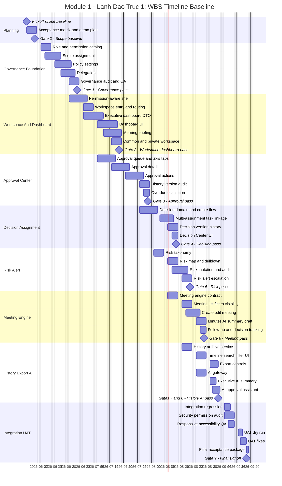

# Module 1 - Lãnh Đạo Trục 1: WBS, Timeline Và Gantt

## 1. Mục Đích

Tài liệu này là kế hoạch WBS độc lập để dùng cho planning và nghiệm thu Module 1 - Lãnh Đạo trong Trục 1. Tài liệu này không thay thế PRD, architecture hoặc story files trong codebase.

## 2. Giả Định Lập Kế Hoạch

- Phạm vi: Module 1 - Lãnh Đạo của Trục 1.
- Ngày bắt đầu giả định: 2026-06-01.
- Ngày kết thúc baseline: 2026-09-18.
- Lịch làm việc: thứ Hai đến thứ Sáu.
- Mô hình delivery: các workstream chạy song song có kiểm soát.
- Team baseline:
  - 1 Product Owner/Business Owner.
  - 1 PM/BA.
  - 1 UX/UI Designer.
  - 2 Frontend/Full-stack Engineers.
  - 2 Backend/Full-stack Engineers.
  - 1 QA Engineer.
  - 0.3 DevOps/Supabase support.
- Nếu team nhỏ hơn baseline, timeline nên cộng thêm 30-80% tùy năng lực thực tế.

## 3. Scope

### 3.1 In Scope

- BO Settings tối thiểu cho role, permission, scope, policy, delegation.
- Permission-aware shell và workspace entry.
- Executive Dashboard, Common Center, Private Workspace.
- Approval Center.
- Decision & Assignment Center.
- Risk & Alert Center ở mức Module 1.
- One Meeting Engine cho điều hành.
- History, Archive, Export, Audit visibility.
- Executive AI Advisory ở mức draft/gợi ý.
- Demo data, QA, UAT và acceptance package.

### 3.2 Out Of Scope

- Module 2 - Tìm kiếm & phát triển dự án chuyên sâu.
- Module 3 - Pháp lý V2 chuyên sâu.
- Module 4 - Thiết kế - Quy hoạch - Kỹ thuật - BIM chuyên sâu.
- Module 5 production-grade nếu vượt khỏi proposal/approval/meeting backbone của Module 1.
- Trục 2, Trục 3 chi tiết.
- Full configurable approval engine production-grade.
- Full finance dashboard, full booking room, full AI copilot, AI tự quyết định.

## 4. WBS Tổng Quan

| WBS | Work Package | Deliverable Chính | Start | Finish | Owner Chính | Dependency | Nghiệm Thu |
| --- | --- | --- | --- | --- | --- | --- | --- |
| 0 | Planning & Acceptance Baseline | Scope, demo script, acceptance matrix | 2026-06-01 | 2026-06-05 | PM/BA | None | Owner duyệt scope, AC và demo data plan |
| 1 | RBAC, BO Settings & Governance Foundation | Role, permission, scope, policy, delegation | 2026-06-08 | 2026-06-26 | Backend/Full-stack | 0 | Quyền, scope, audit và settings hoạt động với demo roles |
| 2 | Executive Shell, Workspace & Dashboard | Shell, dashboard, common/private workspace | 2026-06-22 | 2026-07-17 | Frontend/Full-stack | 1 partial | Lãnh đạo vào đúng workspace và xem dữ liệu đúng scope |
| 3 | Approval Center | Queue, detail, actions, history, escalation | 2026-07-06 | 2026-07-31 | Full-stack | 1, 2 partial | Duyệt, từ chối, trả lại, hold, escalate có audit |
| 4 | Decision & Assignment Center | Decision record, multi-assignment, task linkage | 2026-07-27 | 2026-08-14 | Full-stack | 3 partial | Tạo decision và giao nhiều task theo quyền |
| 5 | Risk & Alert Center | Risk taxonomy, map, create/update/close, escalation | 2026-08-03 | 2026-08-21 | Full-stack | 1, 2 | Risk hiển thị dashboard, xử lý theo quyền, có audit |
| 6 | One Meeting Engine | Meeting type, visibility, minutes, AI draft, follow-up | 2026-08-10 | 2026-08-28 | Full-stack | 1, 4 partial | Họp liên kết decision/task/approval đúng scope |
| 7 | History, Archive, Export & Audit | Timeline, audit visibility, export guard | 2026-08-17 | 2026-09-04 | Backend/QA | 3, 4, 5 partial | Lịch sử và export theo quyền, không lộ dữ liệu |
| 8 | Executive AI Advisory | AI summary, citation, proposed action guard | 2026-08-24 | 2026-09-04 | AI/Full-stack | 2, 3, 6 partial | AI chỉ draft/gợi ý, có citation, không tự mutate |
| 9 | Integration, QA, UAT & Signoff | Regression, UAT, fix, final acceptance pack | 2026-09-07 | 2026-09-18 | PM/QA | 1-8 | Khách hàng nghiệm thu Module 1 |

## 5. WBS Chi Tiết

| WBS | Task | Output | Start | Finish | Acceptance Output |
| --- | --- | --- | --- | --- | --- |
| 0.1 | Kickoff scope Module 1 | Biên bản phạm vi và owner quyết định | 2026-06-01 | 2026-06-01 | Owner xác nhận phạm vi Module 1 |
| 0.2 | Acceptance matrix | Ma trận feature, AC, role, dữ liệu demo | 2026-06-01 | 2026-06-03 | AC đủ để nghiệm thu từng work package |
| 0.3 | Demo role/data plan | Danh sách user demo, role, scope, scenario | 2026-06-03 | 2026-06-05 | Dữ liệu demo bao phủ Chairman, CEO, PM, Dept Head, Assistant, Viewer |
| 0.4 | UAT script baseline | Script demo/nghiệm thu bản đầu | 2026-06-04 | 2026-06-05 | Có checklist UAT cho từng gate |
| 1.1 | Role template catalog | Role tiếng Việt và permission catalog | 2026-06-08 | 2026-06-12 | Role có thể cấu hình, không hardcode trong UI |
| 1.2 | Scope assignment | Gán quyền theo organization/project/axis/module/action | 2026-06-10 | 2026-06-17 | User chỉ thấy dữ liệu trong scope |
| 1.3 | Policy settings | Ngưỡng duyệt tiền, risk group, escalation policy | 2026-06-15 | 2026-06-22 | Policy đọc từ service/config, không hardcode |
| 1.4 | Delegation | Thư ký/trợ lý thao tác trong phạm vi ủy quyền | 2026-06-18 | 2026-06-24 | Assistant tạo/submit thay, không approve thay |
| 1.5 | Governance audit foundation | Audit cho permission, policy, delegation | 2026-06-22 | 2026-06-26 | Mutation quan trọng có audit payload |
| 1.6 | Governance QA gate | Test permission, scope, audit, negative cases | 2026-06-25 | 2026-06-26 | Gate 1 pass |
| 2.1 | Permission-aware shell | Sidebar/topbar/workspace selector theo quyền | 2026-06-22 | 2026-06-30 | Không có quyền thì không thấy module/data |
| 2.2 | Workspace entry | Entry đúng Command Center, phân biệt Trục 1 và Dashboard Module 1 | 2026-06-29 | 2026-07-03 | Direct URL không quyền trả 403 |
| 2.3 | Executive dashboard DTO | KPI, approval, risk, deadline, decision data theo scope | 2026-06-29 | 2026-07-08 | DTO filter server-side trước khi UI nhận |
| 2.4 | Dashboard UI | KPI strip, priority queue, risk summary, drill-down | 2026-07-06 | 2026-07-15 | Dashboard đọc được, responsive, không leak finance |
| 2.5 | Morning briefing | Briefing theo scope, AI draft/insufficient context state | 2026-07-09 | 2026-07-17 | Briefing hiển thị đúng scope |
| 2.6 | Common/private workspace | Common Center và workspace theo vai trò | 2026-07-13 | 2026-07-17 | Chairman/CEO/PM/Assistant nhìn khác nhau theo scope |
| 2.7 | Workspace QA gate | Responsive, 403, drill-down, no-render-before-auth | 2026-07-16 | 2026-07-17 | Gate 2 pass |
| 3.1 | Approval queue | Tabs Trục 1/2/3, queue theo loại request | 2026-07-06 | 2026-07-14 | Trục 1 có data, Trục 2/3 placeholder rõ |
| 3.2 | Approval detail | Request summary, policy, amount, attachments, links | 2026-07-13 | 2026-07-21 | Detail không lộ finance khi thiếu quyền |
| 3.3 | Approval action panel | Approve, reject, return, forward, ask meeting, hold, cancel | 2026-07-20 | 2026-07-28 | Reject/return bắt buộc lý do, destructive có confirm |
| 3.4 | Approval history/version/audit | Timeline, actor, transition, version, audit visibility | 2026-07-27 | 2026-07-31 | Final approval vẫn truy vết được |
| 3.5 | Overdue/escalation | Severity, reason, target, mock notification/outbox | 2026-07-29 | 2026-07-31 | Quá hạn/escalation hiện trên detail/dashboard |
| 3.6 | Approval QA gate | Permission, stale action, redaction, audit regression | 2026-07-30 | 2026-07-31 | Gate 3 pass |
| 4.1 | Decision domain | Decision record độc lập, source approval/meeting/manual | 2026-07-27 | 2026-08-04 | Decision khác approval, có scope rõ |
| 4.2 | Decision create actions | Tạo decision theo quyền, audit create | 2026-08-03 | 2026-08-07 | Không quyền không tạo được, không leak source |
| 4.3 | Multi-assignment | Một decision tạo nhiều assignment/task | 2026-08-06 | 2026-08-12 | Giao nhiều người/phòng ban/dự án |
| 4.4 | Decision version/history | Version khi sửa deadline/owner/KPI/priority/scope | 2026-08-10 | 2026-08-14 | Sửa nội dung quan trọng tạo version |
| 4.5 | Decision Center UI | List/detail/action/status view | 2026-08-12 | 2026-08-14 | Gate 4 pass |
| 5.1 | Risk taxonomy | Level, category, status suggestion | 2026-08-03 | 2026-08-07 | Risk group cấu hình được |
| 5.2 | Risk map | Risk map, severity, owner, deadline, drill-down | 2026-08-10 | 2026-08-14 | Không phụ thuộc màu, có label và lý do |
| 5.3 | Risk mutation | Tạo/cập nhật/override/đóng risk theo quyền | 2026-08-12 | 2026-08-19 | Override/close có lý do và audit |
| 5.4 | Risk alert/escalation | Quá hạn, escalation, draft suggestion | 2026-08-17 | 2026-08-21 | Risk nghiêm trọng lên dashboard/briefing |
| 5.5 | Risk QA gate | Permission, audit, dashboard integration | 2026-08-20 | 2026-08-21 | Gate 5 pass |
| 6.1 | Meeting engine contract | Meeting types, visibility, related records | 2026-08-10 | 2026-08-14 | Không tách nhiều module họp cứng |
| 6.2 | Meeting list/filter | List, filter, executive visibility | 2026-08-17 | 2026-08-21 | Executive chỉ thấy meeting trong scope |
| 6.3 | Create/edit meeting | Agenda, participants, external participants, attachments | 2026-08-19 | 2026-08-25 | Tạo/sửa/hủy meeting có audit |
| 6.4 | Minutes & AI summary draft | Minutes, transcript placeholder, AI summary draft approve state | 2026-08-24 | 2026-08-28 | AI summary chưa approve là draft |
| 6.5 | Follow-up & decision tracking | Follow-up action tạo task, liên kết decision | 2026-08-26 | 2026-08-28 | Gate 6 pass |
| 7.1 | History/archive service | Unified history query across approval/decision/risk/meeting | 2026-08-17 | 2026-08-21 | History filter theo quyền |
| 7.2 | Timeline/search/filter UI | Timeline, filters, detail links | 2026-08-24 | 2026-08-28 | Timeline đọc được, truy vết rõ |
| 7.3 | Export controls | Export permission, sensitive export audit | 2026-08-31 | 2026-09-03 | Không có quyền thì export bị chặn |
| 7.4 | History/export QA gate | Audit visibility, no leak, file/output state | 2026-09-03 | 2026-09-04 | Gate 7 pass |
| 8.1 | AI gateway | Permission context, citation contract, no auto mutation | 2026-08-24 | 2026-08-28 | AI chỉ đọc dữ liệu được phép |
| 8.2 | Executive AI summary | Workspace/context summary draft | 2026-08-31 | 2026-09-02 | Summary có source/citation hoặc insufficient context |
| 8.3 | AI approval assistant | Completeness/risk/action proposal preview | 2026-09-01 | 2026-09-04 | AI không approve, chỉ đề xuất |
| 8.4 | AI QA gate | Permission, citation, proposed action guard | 2026-09-03 | 2026-09-04 | Gate 8 pass |
| 9.1 | Integration regression | Cross-feature regression pass | 2026-09-07 | 2026-09-09 | Core happy paths pass |
| 9.2 | Security and permission audit | 403, no-fetch/no-render, sensitive redaction | 2026-09-07 | 2026-09-11 | Security signoff nội bộ |
| 9.3 | Responsive/accessibility QA | Desktop/tablet/mobile, keyboard/focus, Vietnamese text | 2026-09-09 | 2026-09-11 | UI đạt mức nghiệm thu |
| 9.4 | UAT dry run | Demo script chạy với data nghiệm thu | 2026-09-14 | 2026-09-15 | Dry run pass hoặc có fix list |
| 9.5 | UAT fixes | Sửa lỗi nghiệm thu mức blocking/high | 2026-09-15 | 2026-09-17 | Không còn blocker nghiệm thu |
| 9.6 | Final acceptance package | Release note, known gaps, UAT evidence, signoff checklist | 2026-09-18 | 2026-09-18 | Gate 9 final signoff |

## 6. Milestone Và Gate Nghiệm Thu

| Gate | Ngày | Điều Kiện Qua Gate |
| --- | --- | --- |
| Gate 0 - Scope Baseline | 2026-06-05 | Scope, AC, demo data plan và UAT script baseline được duyệt |
| Gate 1 - Governance Foundation | 2026-06-26 | Role, permission, scope, policy, delegation, audit foundation pass |
| Gate 2 - Workspace/Dashboard | 2026-07-17 | Dashboard, workspace, drill-down, 403 và responsive pass |
| Gate 3 - Approval Center | 2026-07-31 | Queue, detail, actions, history, escalation pass |
| Gate 4 - Decision/Assignment | 2026-08-14 | Decision, multi-assignment, version/history pass |
| Gate 5 - Risk/Alert | 2026-08-21 | Risk map, mutation, alert/escalation, audit pass |
| Gate 6 - Meeting Engine | 2026-08-28 | Meeting, minutes, follow-up task, decision tracking pass |
| Gate 7 - History/Export/Audit | 2026-09-04 | Timeline, filter, export controls, audit visibility pass |
| Gate 8 - AI Advisory | 2026-09-04 | AI draft, citation, permission guard, no auto mutation pass |
| Gate 9 - Final UAT | 2026-09-18 | Khách hàng nghiệm thu Module 1 hoặc ký danh sách gap |

## 7. Mermaid Gantt Chart



## 8. Critical Path

Critical path baseline:

```text
Scope baseline
-> Governance foundation
-> Workspace/Dashboard
-> Approval Center
-> Decision/Assignment
-> Integration regression
-> UAT
-> Final signoff
```

Risk, Meeting, History và AI có thể chạy song song sau khi governance và workspace foundation đủ ổn, nhưng vẫn cần quay lại integration/UAT chung.

## 9. Nghiệm Thu Cuối Module 1

Module 1 được xem là nghiệm thu khi:

- Người dùng có quyền vào đúng workspace theo role/scope.
- Người không có quyền không thấy module/dữ liệu và direct URL trả 403.
- Dashboard hiển thị KPI, approval, risk, deadline, decision mới đúng scope.
- Approval có queue, detail, approve/reject/return/hold/escalate/cancel, history và audit.
- Decision tạo được từ approval/meeting/độc lập và tạo được nhiều assignment/task.
- Risk nghiêm trọng/quá hạn hiển thị trên dashboard/common center/morning briefing.
- Meeting có type, visibility, minutes, AI summary draft, follow-up task và decision tracking.
- History/export/audit hoạt động theo quyền.
- AI chỉ tóm tắt/gợi ý với citation hoặc insufficient-context state, không tự mutate.
- UAT pass với ít nhất các role: Chủ tịch/Super Admin, CEO, Giám đốc dự án, Trưởng bộ phận, Thư ký/Trợ lý, Viewer.
- Có danh sách gap/future enhancement được owner ký nhận.

## 10. Rủi Ro Kế Hoạch

| Risk | Ảnh Hưởng | Mitigation |
| --- | --- | --- |
| Scope creep sang Module 2-5 | Trễ nghiệm thu Module 1 | Chặn bằng out-of-scope và ghi gap riêng |
| Permission/scope chưa rõ | Dễ lộ dữ liệu hoặc sai UAT | Chốt role demo và matrix permission từ Gate 0 |
| Approval/decision/risk/meeting trộn logic | Khó audit, khó maintain | Bắt buộc service boundary và audit payload riêng |
| AI bị hiểu là tính năng quyết định tự động | Rủi ro nghiệp vụ | UI ghi rõ draft/gợi ý, mọi mutation cần human confirmation |
| Team nhỏ hơn baseline | Timeline trễ | Giảm parallel work hoặc kéo dài timeline |
| Dữ liệu demo không đủ | UAT không thuyết phục | Chuẩn bị demo data từ Gate 0 và cập nhật theo từng gate |
