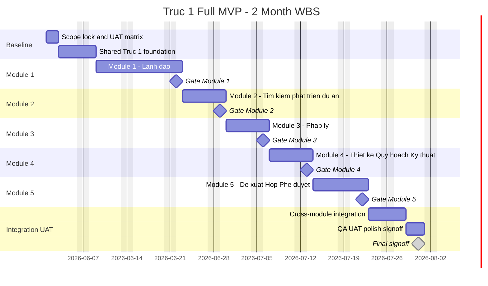

# Trục 1 - WBS 2 Tháng

## 1. Mục Đích

Tài liệu này là WBS timebox 2 tháng cho **Trục 1 - Phát triển & Hình thành dự án**. Mục tiêu là làm **full MVP end-to-end cho 5 module Trục 1**, đủ demo, nghiệm thu và có luồng dữ liệu xuyên suốt.

Tài liệu này phục vụ planning/nghiệm thu, không thay thế PRD, architecture hoặc story files hiện có.

## 2. Nhận Định Hiện Trạng

Module 1 - Lãnh đạo đã được đi sâu nhất: đã có PRD, epics, stories, sprint status và nhiều implementation artifacts.

Module 2, 3, 4, 5 hiện mới có requirement/scope cấp cao trong blueprint/planning docs. Các module này chưa có đủ PRD, epic/story và data model chi tiết như Module 1. Vì vậy WBS 2 tháng phải đi theo hướng **MVP nén**, không cố triển khai production-depth cho từng nghiệp vụ.

## 3. Giả Định

- Team: 1 dev solo full-time, dùng AI hằng ngày.
- Quy trình: BMAD.
- Timeline: 2 tháng lịch, giả định từ `2026-06-01` đến `2026-07-31`.
- Lịch làm việc: thứ Hai đến thứ Sáu.
- Trục 2 và Trục 3: không tính trong plan này.
- Module 1: tiếp tục là nền điều hành chính.
- Module 2-5: làm đủ surface, data model MVP, luồng chính, dashboard feed, proposal/task/document linkage và UAT scenario.
- Không build sâu các engine production-grade nếu không cần để nghiệm thu MVP.

## 4. Định Nghĩa "Full Trục 1" Trong 2 Tháng

Trong plan này, "full Trục 1" nghĩa là:

- Có đủ 5 module hiển thị và dùng được.
- Có dữ liệu project/opportunity/legal/design/proposal liên kết với nhau.
- Có dashboard/Command Center nhìn được trạng thái Trục 1.
- Có task, document, proposal, meeting, decision, risk liên quan.
- Có permission, 403, audit cho action quan trọng.
- Có UAT script và demo data đủ cho owner nghiệm thu.

Không có nghĩa là:

- Legal V2 production-grade đầy đủ.
- Due diligence chuyên sâu.
- CAD/BIM viewer thật.
- Finance tiền khả thi nâng cao.
- Full configurable approval engine.
- Data room production-grade.
- Stage gate workflow configurable đầy đủ.

## 5. Scope Nén Bắt Buộc

Để giữ 2 tháng, các quyết định nén scope là bắt buộc:

| Khu Vực | Làm Trong 2 Tháng | Để Sau |
| --- | --- | --- |
| Module 1 | Dashboard, workspace, approval, decision, risk, meeting, history, AI mức MVP | Full admin suite, advanced AI |
| Module 2 | Opportunity/project sourcing MVP, khảo sát, tiền khả thi nền, đề xuất hướng xử lý | Due diligence sâu, tài chính phân tích sâu |
| Module 3 | Legal checklist 12 bước, hồ sơ, blocker, phản hồi cơ quan mức nền | Legal submissions/authority workflow đầy đủ |
| Module 4 | Quy hoạch, thiết kế cơ sở, bản vẽ/BIM metadata mức nền | CAD/BIM viewer/editor, design workflow sâu |
| Module 5 | Proposal/request, meeting, approval states, task follow-up, audit | Full approval routing configurable |
| AI | Summary/gợi ý/citation/draft | AI tự quyết, prediction thật |

## 6. WBS Tổng Quan

| WBS | Work Package | Duration | Start | Finish | Output Nghiệm Thu |
| --- | --- | ---: | --- | --- | --- |
| 0 | BMAD Scope Lock & Acceptance Baseline | 2 ngày | 2026-06-01 | 2026-06-02 | Scope, out-of-scope, UAT matrix, demo roles |
| 1 | Shared Trục 1 Foundation | 4 ngày | 2026-06-03 | 2026-06-08 | Navigation, module config, seed, permission baseline |
| 2 | Module 1 - Lãnh Đạo | 10 ngày | 2026-06-09 | 2026-06-22 | Leadership operating layer usable |
| 3 | Module 2 - Tìm Kiếm & Phát Triển Dự Án | 5 ngày | 2026-06-23 | 2026-06-29 | Opportunity/project sourcing MVP |
| 4 | Module 3 - Pháp Lý | 5 ngày | 2026-06-30 | 2026-07-06 | Legal 12-step MVP, hồ sơ, blocker |
| 5 | Module 4 - Thiết Kế - Quy Hoạch - Kỹ Thuật - BIM | 5 ngày | 2026-07-07 | 2026-07-13 | Planning/design/BIM metadata MVP |
| 6 | Module 5 - Đề Xuất - Họp - Phê Duyệt Nội Bộ | 7 ngày | 2026-07-14 | 2026-07-22 | Proposal/meeting/approval MVP |
| 7 | Cross-Module Integration | 4 ngày | 2026-07-23 | 2026-07-28 | End-to-end Trục 1 flow |
| 8 | QA, UAT, Polish, Signoff | 3 ngày | 2026-07-29 | 2026-07-31 | UAT pass, known gaps, signoff package |

Ghi chú: baseline này ép đúng 2 tháng lịch. Vì vậy Module 2-5 chỉ được làm ở mức MVP nén, mỗi module có một luồng chính, dữ liệu mẫu, permission/audit cơ bản và UAT gate ngắn.

## 7. WBS Chi Tiết

### 0. BMAD Scope Lock & Acceptance Baseline

| WBS | Task | Output | Acceptance |
| --- | --- | --- | --- |
| 0.1 | Chốt định nghĩa full MVP Trục 1 | Scope baseline | Owner đồng ý "full MVP" không phải production-depth |
| 0.2 | Chốt 5 module và out-of-scope | Scope guardrail | Module 2-5 không mở scope lan |
| 0.3 | Chốt demo roles | Role matrix | Có Chairman/CEO/PM/Legal/Design/Assistant/Viewer |
| 0.4 | Chốt UAT matrix | UAT checklist | Mỗi module có scenario nghiệm thu |
| 0.5 | Chốt BMAD operating rhythm | Execution rule | Mỗi module tạo story ngắn, dev, review, fix, UAT |

### 1. Shared Trục 1 Foundation

| WBS | Task | Output | Acceptance |
| --- | --- | --- | --- |
| 1.1 | Module registry Trục 1 | 5 module config/navigation | UI chỉ hiện module có quyền |
| 1.2 | Axis/workstream scope | Scope model cho module/workstream | Service filter theo project/axis/module/action |
| 1.3 | Shared project/opportunity context | Project/opportunity DTO dùng chung | Module 2-5 link được về project |
| 1.4 | Shared document/task/proposal linkage | Link contract | Task/document/proposal gắn được module nguồn |
| 1.5 | Demo seed data | Seed Trục 1 end-to-end | Có ít nhất 3-5 dự án/cơ hội đủ trạng thái |
| 1.6 | Shared audit events | Audit event contract | Action quan trọng có audit payload |

### 2. Module 1 - Lãnh Đạo

| WBS | Task | Output | Acceptance |
| --- | --- | --- | --- |
| 2.1 | Workspace entry | Command Center/Module 1 entry | Người dùng vào đúng workspace theo role |
| 2.2 | Dashboard tổng quan lãnh đạo | KPI, risk, approval, deadline, decision cards | Data theo scope, không hardcode |
| 2.3 | Executive Common Center | Common center filtered by permission | Risk/approval nghiêm trọng hiện đúng quyền |
| 2.4 | Private Workspace | View theo Chairman/CEO/PM/Assistant/Viewer | Role khác nhau nhìn khác nhau |
| 2.5 | Approval Center surface | Queue/detail/action basic | Approve/reject/return/hold/escalate có audit |
| 2.6 | Decision & Assignment basic | Decision record, assignment/task linkage | Decision tạo được từ approval/meeting/độc lập |
| 2.7 | Risk/Alert surface | Risk summary, blocker, escalation signals | Risk nghiêm trọng feed dashboard |
| 2.8 | Meeting/History/AI surface | Meeting summary, timeline, AI draft | AI chỉ gợi ý/draft, không mutate |
| 2.9 | Module 1 UAT | Demo and bugfix | Gate Module 1 pass |

### 3. Module 2 - Tìm Kiếm & Phát Triển Dự Án

| WBS | Task | Output | Acceptance |
| --- | --- | --- | --- |
| 3.1 | Opportunity/project intake | Form/list/detail cơ hội | Tạo được cơ hội/dự án mới |
| 3.2 | Source and land dossier | Nguồn cơ hội, chủ đất, đối tác, hiện trạng | Có hồ sơ quỹ đất/cơ hội |
| 3.3 | Site survey MVP | Khảo sát, hình ảnh/link, ghi chú | Ghi nhận khảo sát và owner |
| 3.4 | Development condition check | Điều kiện phát triển theo loại dự án | Không hardcode NƠXH |
| 3.5 | Pre-feasibility lite | Chi phí/hiệu quả/risk ghi nhận mức nền | Có đánh giá sơ bộ |
| 3.6 | Recommendation outcome | Tiếp tục/bổ sung/tạm dừng/loại bỏ/trình duyệt | Outcome feed proposal/dashboard |
| 3.7 | Module 2 UAT | Demo and bugfix | Gate Module 2 pass |

### 4. Module 3 - Pháp Lý

| WBS | Task | Output | Acceptance |
| --- | --- | --- | --- |
| 4.1 | Legal 12-step view | Checklist 12 bước | Không hiển thị thành 12 menu ngang hàng |
| 4.2 | Legal step update | Status, owner, deadline, notes | Blocked bắt buộc lý do |
| 4.3 | Legal documents | Hồ sơ pháp lý gắn step/project | Hồ sơ thiếu/cần bổ sung rõ |
| 4.4 | Authority response lite | Phản hồi cơ quan mức nền | Theo dõi chờ cơ quan/đã phản hồi |
| 4.5 | Legal blocker/risk | Blocker pháp lý | Feed dashboard/risk |
| 4.6 | Legal request to leadership | Request trình lãnh đạo | Link proposal/approval |
| 4.7 | Module 3 UAT | Demo and bugfix | Gate Module 3 pass |

### 5. Module 4 - Thiết Kế - Quy Hoạch - Kỹ Thuật - BIM

| WBS | Task | Output | Acceptance |
| --- | --- | --- | --- |
| 5.1 | Planning analysis record | Chỉ tiêu quy hoạch, ghi chú, trạng thái | Có view/list/detail |
| 5.2 | 1/500 package metadata | Hồ sơ 1/500 mức metadata | Link document/legal step |
| 5.3 | Basic design package | Thiết kế cơ sở, version, status | Có document/version metadata |
| 5.4 | Drawing/BIM metadata | CAD/PDF/BIM link metadata | Không build viewer thật |
| 5.5 | Design issue/change lite | Vấn đề kỹ thuật/thay đổi thiết kế | Tạo task/request khi cần |
| 5.6 | Request to leadership | Trình duyệt phương án/hồ sơ | Link proposal/approval |
| 5.7 | Module 4 UAT | Demo and bugfix | Gate Module 4 pass |

### 6. Module 5 - Đề Xuất - Họp - Phê Duyệt Nội Bộ

| WBS | Task | Output | Acceptance |
| --- | --- | --- | --- |
| 6.1 | Proposal/request workspace | List/create/detail request | Request gắn project/module/source |
| 6.2 | Proposal states | Draft/submitted/reviewing/approved/rejected/returned/cancelled/overdue | State transition rõ |
| 6.3 | Approval actions | Approve/reject/return/hold/escalate/cancel | Có validation và audit |
| 6.4 | Meeting linkage | Request họp, meeting record, participants | Meeting link project/module/proposal |
| 6.5 | Decision history | Decision sau duyệt/họp | Lịch sử quyết định truy vết được |
| 6.6 | Follow-up task | Task sau họp/phê duyệt | Task owner/deadline/status rõ |
| 6.7 | Module 5 UAT | Demo and bugfix | Gate Module 5 pass |

### 7. Cross-Module Integration

| WBS | Task | Output | Acceptance |
| --- | --- | --- | --- |
| 7.1 | End-to-end project formation flow | Cơ hội -> pháp lý/thiết kế -> proposal -> approval -> decision/task | Demo chạy xuyên suốt |
| 7.2 | Dashboard aggregation | Trục 1 status, blocker, missing docs, pending approvals | Dashboard phản ánh thay đổi từ module 2-5 |
| 7.3 | Permission regression | Role/scope/direct URL/security | Không leak dữ liệu |
| 7.4 | Audit regression | Audit cho create/update/approval/decision/export | Audit đủ cho nghiệm thu |
| 7.5 | Seed refresh | Demo data final | UAT data ổn định |

### 8. QA, UAT, Polish, Signoff

| WBS | Task | Output | Acceptance |
| --- | --- | --- | --- |
| 8.1 | Smoke test toàn Trục 1 | Smoke test result | Không còn blocker flow chính |
| 8.2 | Responsive/accessibility pass | Desktop/tablet/mobile check | Text tiếng Việt không vỡ, focus/action rõ |
| 8.3 | UAT dry run | Demo script chạy thử | Owner review trước final |
| 8.4 | Fix blocking/high issues | Fix list | Blocking/high resolved hoặc accepted as gap |
| 8.5 | Final acceptance package | Signoff checklist, known gaps, demo data, release note | Owner ký nghiệm thu/gap list |

## 8. Timeline 2 Tháng Theo Tuần

| Tuần | Focus | Gate |
| --- | --- | --- |
| Week 1 | Scope lock + Shared foundation | Gate 0/1 |
| Week 2 | Module 1 - Lãnh đạo part 1 |  |
| Week 3 | Module 1 - Lãnh đạo part 2 + UAT | Gate 2 |
| Week 4 | Module 2 - Tìm kiếm & phát triển dự án | Gate 3 |
| Week 5 | Module 3 - Pháp lý | Gate 4 |
| Week 6 | Module 4 - Thiết kế - Quy hoạch - Kỹ thuật - BIM | Gate 5 |
| Week 7 | Module 5 - Đề xuất - Họp - Phê duyệt nội bộ | Gate 6 |
| Week 8 | Integration, QA, UAT, signoff | Gate 7/8 |

Nếu cần giữ đúng 8 tuần tuyệt đối, Module 2-5 phải được làm ở mức MVP rất gọn: mỗi module khoảng 1 tuần và không mở rộng sau khi đã chốt UAT.

## 9. Mermaid Gantt



## 10. Điều Kiện Để Đóng Đúng 2026-07-31

Để nghiệm thu trước hoặc đúng `2026-07-31`, scope ép như sau:

| Module | Cắt Giảm |
| --- | --- |
| Module 1 | Chỉ giữ dashboard, approval, decision, workspace; risk/meeting/history/AI ở mức summary |
| Module 2 | Chỉ opportunity intake + survey + outcome |
| Module 3 | Chỉ 12-step checklist + blocker + document links |
| Module 4 | Chỉ metadata quy hoạch/thiết kế/bản vẽ, không có issue/change flow riêng |
| Module 5 | Chỉ proposal/request + approve/reject/return + audit basic |
| Integration | Chỉ 1 end-to-end happy path + security smoke |

Phiên bản này có thể gọi là **full MVP Trục 1**, nhưng không nên gọi là full production-depth nếu owner kỳ vọng nhiều edge cases.

## 11. Rủi Ro Chính

| Risk | Ảnh Hưởng | Control |
| --- | --- | --- |
| Module 2-5 chưa có story sâu | Dev mất thời gian discovery trong sprint | Mỗi module dùng 0.5 ngày đầu để tạo micro-PRD/story |
| Owner đổi nghiệp vụ trong UAT | Vỡ 2 tháng | Dùng change log, đưa non-blocking vào future |
| Module 5 phình thành approval engine đầy đủ | Trễ lớn | Giữ approval MVP, routing nâng cao để sau |
| Legal/Design bị yêu cầu production-depth | Trễ lớn | Chỉ metadata/workflow MVP |
| 1 dev solo bị quá tải QA | Bug lọt UAT | Mỗi module có smoke test và fixed UAT script |

## 12. Khuyến Nghị Chốt Với Owner

Thông điệp nên chốt:

```text
Trong 2 tháng, làm full Trục 1 ở mức MVP end-to-end: đủ 5 module, đủ luồng chính, đủ demo/nghiệm thu, có permission/audit cơ bản. 
Không làm production-depth cho Legal V2, BIM/CAD, tài chính tiền khả thi nâng cao hoặc approval engine configurable đầy đủ.
```

Nếu owner chấp nhận định nghĩa này, plan 2 tháng có thể chạy bằng BMAD với 1 dev solo + AI. Nếu owner muốn full production-depth cho cả 5 module, cần tăng team hoặc tăng timeline.
