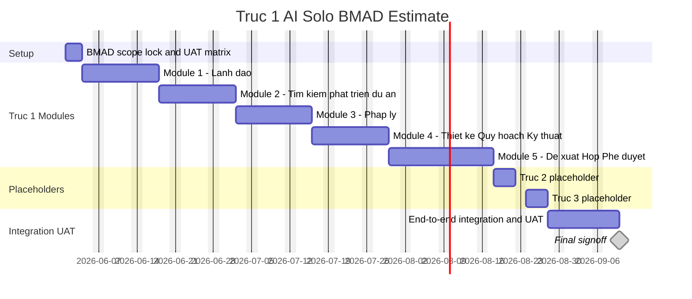

# Trục 1 AI Solo BMAD Estimate

## 1. Giả Định

- Team: 1 dev solo full-time, dùng AI làm pair engineer.
- Quy trình: BMAD, chạy theo vòng `create-story -> dev-story -> code-review -> fix -> next story`.
- Baseline người dùng đưa ra: Module 1 - Lãnh đạo Trục 1 hoàn thành trong 2 tuần.
- Các module khác trong Trục 1 estimate tuyến tính theo độ lớn tương đương, có điều chỉnh rủi ro nhẹ.
- Trục 2 và Trục 3 chỉ làm placeholder/shell, không triển khai nghiệp vụ sâu.
- Estimate này phục vụ planning/nghiệm thu, không phải cam kết fixed bid.

## 2. Kết Luận Nhanh

Nếu Module 1 làm xong trong 2 tuần với 1 dev + AI, timeline hợp lý cho toàn bộ Trục 1 là:

```text
Module 1 - Lãnh đạo:                              2.0 tuần
Module 2 - Tìm kiếm & phát triển dự án:           2.0-2.5 tuần
Module 3 - Pháp lý:                               2.0-2.5 tuần
Module 4 - Thiết kế - Quy hoạch - Kỹ thuật - BIM: 2.0-2.5 tuần
Module 5 - Đề xuất - Họp - Phê duyệt nội bộ:      2.0-3.0 tuần
Integration/UAT toàn Trục 1:                      1.0-1.5 tuần
Trục 2 placeholder:                               0.5 tuần
Trục 3 placeholder:                               0.5 tuần
```

Baseline realistic: **12-14 tuần**.

Aggressive nếu scope rất chặt, mock-first, ít rework: **10-11 tuần**.

Conservative nếu phải polish UI, nhiều UAT change, permission phức tạp: **15-18 tuần**.

## 3. Timeline Baseline

| Phase | Scope | Duration | Start | Finish | Output Nghiệm Thu |
| --- | --- | ---: | --- | --- | --- |
| 0 | BMAD setup, scope lock, demo/UAT matrix | 0.5 tuần | W0 | W0 | Scope và checklist nghiệm thu |
| 1 | Module 1 - Lãnh đạo | 2.0 tuần | W1 | W2 | Dashboard, workspace, approval, decision, risk/meeting/history/AI ở mức Module 1 |
| 2 | Module 2 - Tìm kiếm & phát triển dự án | 2.0 tuần | W3 | W4 | Opportunity/project sourcing, khảo sát, tiền khả thi nền, đề xuất tiếp tục/tạm dừng |
| 3 | Module 3 - Pháp lý | 2.0 tuần | W5 | W6 | Checklist 12 bước, hồ sơ pháp lý, blocker, phản hồi cơ quan mức MVP |
| 4 | Module 4 - Thiết kế - Quy hoạch - Kỹ thuật - BIM | 2.0 tuần | W7 | W8 | Quy hoạch, 1/500, thiết kế cơ sở, bản vẽ/BIM metadata mức nền |
| 5 | Module 5 - Đề xuất - Họp - Phê duyệt nội bộ | 2.5 tuần | W9 | W11.5 | Proposal/request, approval states, meeting, task follow-up, audit |
| 6 | Trục 2 placeholder | 0.5 tuần | W11.5 | W12 | Shell/card/routes placeholder |
| 7 | Trục 3 placeholder | 0.5 tuần | W12 | W12.5 | Shell/card/routes placeholder |
| 8 | Integration/UAT toàn Trục 1 | 1.5 tuần | W12.5 | W14 | End-to-end demo, bugfix, signoff/gap list |

## 4. Timeline Theo Ngày Lịch Ví Dụ

Giả sử bắt đầu thứ Hai `2026-06-01`:

| Phase | Start | Finish |
| --- | --- | --- |
| BMAD setup/scope lock | 2026-06-01 | 2026-06-03 |
| Module 1 - Lãnh đạo | 2026-06-04 | 2026-06-17 |
| Module 2 - Tìm kiếm & phát triển dự án | 2026-06-18 | 2026-07-01 |
| Module 3 - Pháp lý | 2026-07-02 | 2026-07-15 |
| Module 4 - Thiết kế - Quy hoạch - Kỹ thuật - BIM | 2026-07-16 | 2026-07-29 |
| Module 5 - Đề xuất - Họp - Phê duyệt nội bộ | 2026-07-30 | 2026-08-17 |
| Trục 2 placeholder | 2026-08-18 | 2026-08-21 |
| Trục 3 placeholder | 2026-08-24 | 2026-08-27 |
| Integration/UAT toàn Trục 1 | 2026-08-28 | 2026-09-09 |

Baseline finish: **2026-09-09**.

## 5. Vì Sao Không Nên Tuyến Tính 100%

Module 1 trong 2 tuần là baseline rất aggressive vì nó đang có PRD/epic/story rõ nhất. Các module 2-5 hiện chưa có cùng mức story detail, nên khi scale tuyến tính phải thêm overhead:

- Tạo PRD/story cho từng module.
- Chốt data model còn thiếu.
- UAT từng module.
- Integration ngược lên Module 1 dashboard/approval/decision/risk.
- Rework do owner chỉnh nghiệp vụ.

Vì vậy estimate tuyến tính thuần:

```text
5 module x 2 tuần = 10 tuần
```

Estimate thực tế hơn:

```text
10 tuần build
+ 0.5 tuần setup/scope lock
+ 1-1.5 tuần integration/UAT
+ 1 tuần placeholder Trục 2/3
= 12.5-14 tuần
```

## 6. BMAD Operating Rhythm Cho 1 Dev Solo

Mỗi module nên chạy theo nhịp:

| Step | Duration Target | Output |
| --- | ---: | --- |
| Scope slice | 0.5 ngày | Module scope, out-of-scope, UAT checklist |
| Create stories | 0.5-1 ngày | 4-8 implementation stories |
| Dev stories | 6-8 ngày | Code + tests + local verification |
| Code review/fix | 1-2 ngày | Review findings fixed/deferred |
| Module UAT package | 0.5 ngày | Demo script, known gaps, signoff checklist |

Với 1 dev solo, tránh tạo quá nhiều story trước. Tốt nhất:

```text
create 1-2 stories
-> dev
-> review
-> update context
-> create next stories
```

## 7. Module Estimate Breakdown

### Module 1 - Lãnh đạo: 2 tuần

Điều kiện để đạt:

- Scope chặt theo MVP.
- Dùng mock/Supabase-ready repository, không bắt full production hardening.
- AI hỗ trợ code/test/refactor liên tục.
- UAT chỉ chấp nhận blocking/high issues trong vòng 2 tuần.

### Module 2 - Tìm kiếm & phát triển dự án: 2-2.5 tuần

Work package:

- Opportunity/project sourcing.
- Quỹ đất/hiện trạng/nguồn cơ hội.
- Đánh giá vị trí/quy mô/điều kiện phát triển.
- Tiền khả thi mức nền.
- Đề xuất tiếp tục/tạm dừng/loại bỏ.
- Feed dashboard/approval/decision.

Risk thêm thời gian: chưa có story chi tiết như Module 1.

### Module 3 - Pháp lý: 2-2.5 tuần

Work package:

- Legal checklist 12 bước.
- Hồ sơ pháp lý.
- Trạng thái, owner, deadline, note, blocker.
- Phản hồi cơ quan ở mức MVP.
- Legal risk/blocker.
- Request trình lãnh đạo.

Risk thêm thời gian: required documents và external authority workflow dễ phát sinh scope.

### Module 4 - Thiết kế - Quy hoạch - Kỹ thuật - BIM: 2-2.5 tuần

Work package:

- Quy hoạch/chỉ tiêu.
- 1/500.
- Thiết kế cơ sở.
- Bản vẽ/CAD/PDF metadata.
- BIM metadata placeholder.
- Design issue/change mức nền.
- Request trình lãnh đạo.

Risk thêm thời gian: nếu yêu cầu viewer CAD/BIM thật thì không còn là MVP 2 tuần.

### Module 5 - Đề xuất - Họp - Phê duyệt nội bộ: 2-3 tuần

Work package:

- Proposal/request module surface.
- Approval states.
- Meeting/request linkage.
- Decision history.
- Task follow-up.
- Audit.
- Integration với Module 2-4.

Risk thêm thời gian: đây là backbone liên module, nên có nhiều edge cases hơn các module chuyên môn.

### Trục 2 Placeholder: 0.5 tuần

Chỉ làm:

- Route/shell/card placeholder.
- Mô tả scope tương lai.
- Navigation theo quyền.
- Không build thi công, nhà thầu, nghiệm thu, safety thật.

### Trục 3 Placeholder: 0.5 tuần

Chỉ làm:

- Route/shell/card placeholder.
- Mô tả dashboard/tài chính/vận hành/KPI tương lai.
- Navigation theo quyền.
- Không build finance/control/reporting production.

## 8. Mermaid Gantt



## 9. Điều Kiện Để Giữ Được Timeline 12-14 Tuần

- Chốt rõ MVP: module nào xong là xong, gap đưa vào future list.
- Không đổi requirement giữa module nếu chưa qua correct-course.
- Không yêu cầu production-grade cho placeholder Trục 2/3.
- Không build CAD/BIM viewer thật.
- Không build finance/contract/booking room sâu.
- Không build full configurable approval engine.
- Mỗi module có UAT checklist trước khi code.
- AI tạo code nhưng dev vẫn review, test, và giữ architectural boundary.

## 10. Estimate Chốt

| Kịch Bản | Timeline |
| --- | ---: |
| Aggressive | 10-11 tuần |
| Baseline realistic | 12-14 tuần |
| Conservative | 15-18 tuần |

Khuyến nghị dùng **12-14 tuần** để plan với owner, và giữ **10-11 tuần** là stretch target nội bộ.
