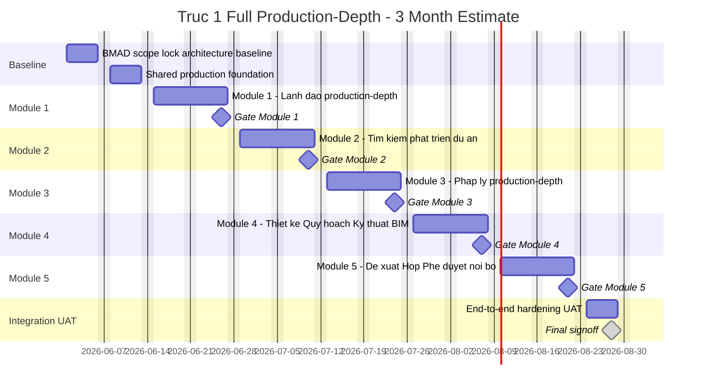

# Trục 1 Full Production-Depth - Estimate 3 Tháng

## 1. Mục Đích

Tài liệu này estimate kế hoạch **full production-depth cho toàn bộ Trục 1 - Phát triển & Hình thành dự án** trong 3 tháng, theo giả định:

- 1 dev solo full-time.
- Có AI hỗ trợ coding, testing, review, documentation.
- Chạy theo BMAD.
- Trục 1 gồm đủ 5 module production-depth.
- Trục 2 và Trục 3 không tính trong plan này.

Đây là bản estimate planning/nghiệm thu, không thay thế PRD/architecture/story files.

## 2. Kết Luận Điều Hành

Với 1 dev solo + AI, **3 tháng cho full production-depth toàn Trục 1 là cực kỳ aggressive**. Có thể lập plan, nhưng confidence thấp nếu hiểu production-depth là:

- data model đủ chặt,
- permission/RLS/server-side guard đầy đủ,
- audit đầy đủ,
- UAT từng module,
- integration end-to-end,
- edge cases chính,
- responsive/accessibility cơ bản,
- không chỉ mock UI.

Timeline 3 tháng chỉ hợp lý khi:

- dùng AI rất mạnh và đều,
- owner ra quyết định nhanh,
- không đổi scope giữa chừng,
- production-depth tập trung vào workflow/data/security chính, không mở các engine quá sâu như CAD/BIM viewer, financial model phức tạp, legal authority workflow cực chi tiết.

## 3. Định Nghĩa Production-Depth Cho Plan Này

Trong plan 3 tháng này, production-depth nghĩa là:

- Có domain model, validation, service, repository/mock-Supabase parity cho từng module.
- Có UI đủ dùng cho list/detail/form/action.
- Có permission guard ở server/service layer.
- Có audit cho mutation quan trọng.
- Có integration với project, task, document, proposal, meeting, decision, risk.
- Có demo/seed data và UAT scenario.
- Có unit/service/component tests cho flow trọng yếu.
- Có known gaps rõ ràng nếu một phần được defer.

Production-depth **không** bao gồm:

- CAD/BIM viewer/editor thật.
- Full financial modeling hoặc IRR/NPV engine sâu.
- Full configurable approval workflow engine visual builder.
- Legal e-government integration.
- Native mobile app.
- Full external collaborator portal.

## 4. Timeline Tổng Quan 3 Tháng

Giả sử bắt đầu `2026-06-01`, kết thúc target `2026-08-28`.

| Phase | Scope | Duration | Start | Finish | Output |
| --- | --- | ---: | --- | --- | --- |
| 0 | BMAD scope lock + architecture baseline | 1 tuần | 2026-06-01 | 2026-06-05 | Scope, WBS dictionary, data model decisions, UAT matrix |
| 1 | Shared production foundation | 1 tuần | 2026-06-08 | 2026-06-12 | Axis/module registry, RBAC/RLS baseline, audit, seed model |
| 2 | Module 1 - Lãnh đạo production-depth | 2 tuần | 2026-06-15 | 2026-06-26 | Dashboard/workspace/approval/decision/risk/meeting/history/AI surface production-ready |
| 3 | Module 2 - Tìm kiếm & phát triển dự án | 2 tuần | 2026-06-29 | 2026-07-10 | Opportunity, land dossier, survey, pre-feasibility, outcome workflow |
| 4 | Module 3 - Pháp lý production-depth | 2 tuần | 2026-07-13 | 2026-07-24 | Legal checklist, documents, submissions lite, authority response, blocker, risk |
| 5 | Module 4 - Thiết kế - Quy hoạch - Kỹ thuật - BIM production-depth | 2 tuần | 2026-07-27 | 2026-08-07 | Planning/design package, drawing/BIM metadata, issue/change workflow |
| 6 | Module 5 - Đề xuất - Họp - Phê duyệt nội bộ production-depth | 2 tuần | 2026-08-10 | 2026-08-21 | Proposal/request, meeting, approval, decision, follow-up task, audit |
| 7 | End-to-end integration, hardening, UAT | 1 tuần | 2026-08-24 | 2026-08-28 | Final UAT, regression, signoff, gap list |

## 5. WBS Production-Depth

### 0. BMAD Scope Lock + Architecture Baseline

| WBS | Work Package | Output | Acceptance |
| --- | --- | --- | --- |
| 0.1 | Full Trục 1 scope contract | Scope + out-of-scope + assumptions | Owner signs scope before dev |
| 0.2 | WBS dictionary | Deliverable, DoD, input/output per module | Each module has measurable acceptance |
| 0.3 | Data model decisions | Entity list, relationships, source-of-truth | No unresolved entity decision before build |
| 0.4 | Permission/action matrix | Role/scope/action by module | 403 and navigation rules clear |
| 0.5 | UAT master script | End-to-end and module UAT cases | UAT can run without ad hoc interpretation |

### 1. Shared Production Foundation

| WBS | Work Package | Output | Acceptance |
| --- | --- | --- | --- |
| 1.1 | Axis/module registry | Config for 5 Trục 1 modules | Module access is permission-aware |
| 1.2 | Shared project/opportunity spine | Project/opportunity/workstream context | All records link to project/scope correctly |
| 1.3 | Shared document/task/proposal linkage | Typed relation contract | Cross-module links consistent |
| 1.4 | RBAC/RLS/server guard baseline | Central service guards | No fetch/render-before-permission |
| 1.5 | Audit event foundation | Audit payload standards | Important mutations write audit |
| 1.6 | Seed and demo factory | Production-like demo data | UAT data covers positive/negative cases |

### 2. Module 1 - Lãnh Đạo

| WBS | Work Package | Output | Acceptance |
| --- | --- | --- | --- |
| 2.1 | Executive shell/workspace | Common/private workspace | Role-based workspace is correct |
| 2.2 | Executive dashboard | KPI, risk, approval, deadline, decision summary | Dashboard derives from services |
| 2.3 | Approval Center integration | Queue/detail/action/history/escalation | Approval flow is auditable |
| 2.4 | Decision & Assignment Center | Decision record, versioning, assignment/task | Decision creates accountable work |
| 2.5 | Risk/Alert executive layer | Risk map, escalation, alert priority | Critical risk surfaces to leadership |
| 2.6 | Meeting/history/AI executive layer | Meeting view, history/export guard, AI draft | AI does not mutate without confirmation |
| 2.7 | Module 1 hardening | Tests, 403, responsive, UAT | Gate Module 1 pass |

### 3. Module 2 - Tìm Kiếm & Phát Triển Dự Án

| WBS | Work Package | Output | Acceptance |
| --- | --- | --- | --- |
| 3.1 | Opportunity lifecycle | Create/list/detail/status/archive | Opportunity is not just a loose note |
| 3.2 | Source and land dossier | Owner/source/land/site metadata | Source and land evidence are traceable |
| 3.3 | Site survey workflow | Survey notes, attachments, conditions | Survey can create task/risk/document |
| 3.4 | Development condition engine lite | Project-type conditions, no hardcoded NƠXH | Conditions configurable enough for MVP |
| 3.5 | Pre-feasibility model | Cost/revenue/risk/assumption fields | Pre-feasibility has structured data |
| 3.6 | Outcome workflow | Continue/supplement/pause/reject/submit proposal | Outcome links to proposal/decision |
| 3.7 | Module 2 hardening | Tests, permission, audit, UAT | Gate Module 2 pass |

### 4. Module 3 - Pháp Lý

| WBS | Work Package | Output | Acceptance |
| --- | --- | --- | --- |
| 4.1 | Legal 12-step production checklist | Status, owner, dependency, required docs | 12 steps remain workflow, not 12 menus |
| 4.2 | Legal document readiness | Required/missing/expired documents | Missing legal docs feed dashboard |
| 4.3 | Legal submission lite | Submission date, authority, status, response due | Waiting authority is trackable |
| 4.4 | Authority response | Response record, decision, next action | Response can update legal step/risk/task |
| 4.5 | Legal blocker/risk | Blocker, severity, owner, deadline | Blocker requires reason and audit |
| 4.6 | Request to leadership | Legal request/proposal link | Legal can escalate to approval/decision |
| 4.7 | Module 3 hardening | Tests, permission, audit, UAT | Gate Module 3 pass |

### 5. Module 4 - Thiết Kế - Quy Hoạch - Kỹ Thuật - BIM

| WBS | Work Package | Output | Acceptance |
| --- | --- | --- | --- |
| 5.1 | Planning analysis | Planning indicators, constraints, status | Planning assumptions are structured |
| 5.2 | 1/500 package tracking | Package metadata, docs, status | 1/500 links to legal/documents |
| 5.3 | Basic design package | Design package, version, owner, status | Design package has version trace |
| 5.4 | Drawing/BIM metadata | Drawing register, BIM file metadata/link | No viewer, but records are governed |
| 5.5 | Technical issue/change workflow | Issue/change, impact, approval need | Issues can create task/proposal/risk |
| 5.6 | Request to leadership | Design/planning request proposal | Leadership approval path exists |
| 5.7 | Module 4 hardening | Tests, permission, audit, UAT | Gate Module 4 pass |

### 6. Module 5 - Đề Xuất - Họp - Phê Duyệt Nội Bộ

| WBS | Work Package | Output | Acceptance |
| --- | --- | --- | --- |
| 6.1 | Proposal/request production surface | Create/list/detail/filter | Requests link source module and evidence |
| 6.2 | Approval workflow depth | State transitions, policy, assignee, due date | Approval states are consistent |
| 6.3 | Action validation | Approve/reject/return/hold/escalate/cancel | Validation and comments enforced |
| 6.4 | Meeting engine integration | Meeting request, agenda, participants, minutes | Meeting links to project/module/proposal |
| 6.5 | Decision and follow-up | Decision history, action items, tasks | Approved items create tracked follow-up |
| 6.6 | Cross-module audit | Proposal/meeting/approval/decision audit | Traceability end-to-end |
| 6.7 | Module 5 hardening | Tests, permission, UAT | Gate Module 5 pass |

### 7. End-To-End Integration, Hardening, UAT

| WBS | Work Package | Output | Acceptance |
| --- | --- | --- | --- |
| 7.1 | End-to-end Trục 1 flow | Opportunity -> legal/design -> proposal -> approval -> decision/task | Happy path and one negative path pass |
| 7.2 | Dashboard aggregation | Leadership dashboard reflects Module 2-5 data | KPI and alerts are not hardcoded |
| 7.3 | Permission/security regression | Role/scope/403/redaction tests | No known critical leak |
| 7.4 | Audit/history/export regression | Timeline and export guard | Important actions traceable |
| 7.5 | UAT and signoff | UAT evidence, known gaps, release note | Owner signs acceptance or gap list |

## 6. Mermaid Gantt



## 7. Critical Path

```text
Scope/data/permission baseline
-> Shared production foundation
-> Module 1 leadership layer
-> Module 2 opportunity data
-> Module 3 legal readiness
-> Module 4 design/planning readiness
-> Module 5 proposal/meeting/approval backbone
-> End-to-end UAT
```

Module 5 should ideally be built earlier because it is a backbone, but with 1 dev solo the sequence above is easier to control. If Module 5 is started earlier in parallel via AI-generated scaffolding, final integration risk drops, but review burden increases.

## 8. Acceptance Gates

| Gate | Date | Acceptance |
| --- | --- | --- |
| Gate 0 | 2026-06-05 | Scope/data/permission/UAT baseline signed |
| Gate 1 | 2026-06-12 | Shared foundation ready |
| Gate 2 | 2026-06-26 | Module 1 production-depth pass |
| Gate 3 | 2026-07-10 | Module 2 production-depth pass |
| Gate 4 | 2026-07-24 | Module 3 production-depth pass |
| Gate 5 | 2026-08-07 | Module 4 production-depth pass |
| Gate 6 | 2026-08-21 | Module 5 production-depth pass |
| Gate 7 | 2026-08-28 | End-to-end Trục 1 UAT/signoff |

## 9. Risk Register

| Risk | Impact | Control |
| --- | --- | --- |
| 3 tháng quá ngắn cho production-depth với 1 dev | High | Timebox từng module 2 tuần, defer non-critical depth explicitly |
| Module 2-5 chưa có story sâu | High | Mỗi module bắt đầu bằng 0.5 ngày micro-PRD/story generation |
| Module 5 backbone để muộn gây integration risk | High | Tạo proposal/meeting/approval contracts trong shared foundation |
| Legal/design scope phình | High | Không build authority integration hoặc CAD/BIM viewer thật |
| Permission/RLS edge cases | High | Dùng service guard tests mỗi gate, RLS live validation nếu dùng Supabase thật |
| UAT feedback nhiều | High | Một UAT gate/module, changes ngoài AC đi correct-course |
| AI-generated code thiếu nhất quán | Medium | Bắt buộc code review/fix sau mỗi story |

## 10. Điều Kiện Để Plan Này Có Thể Chạy

- Owner phải chốt scope production-depth ngay Gate 0.
- Mỗi module chỉ có một vòng UAT chính.
- Không thêm Trục 2/3 vào sprint.
- Không yêu cầu CAD/BIM viewer thật.
- Không yêu cầu full financial analytics engine.
- Không yêu cầu external government/legal integration.
- Không yêu cầu full approval workflow builder.
- Không yêu cầu mobile native.
- Dev phải dùng BMAD chặt: story nhỏ, dev, review, fix, update context.

## 11. Estimate Chốt

Với giả định full production-depth nhưng vẫn giữ các loại deep engine ở ngoài scope, estimate timebox là:

```text
3 tháng / 13 tuần / 2026-06-01 -> 2026-08-28
```

Confidence:

- Aggressive success: 40%.
- Likely with controlled scope and fast owner feedback: 55-65%.
- High risk if owner thay đổi yêu cầu hoặc yêu cầu production-depth không giới hạn.

Nếu muốn confidence cao hơn 75%, nên tăng lên 4-5 tháng hoặc tăng team lên ít nhất 2 dev + 1 QA/BA part-time.
