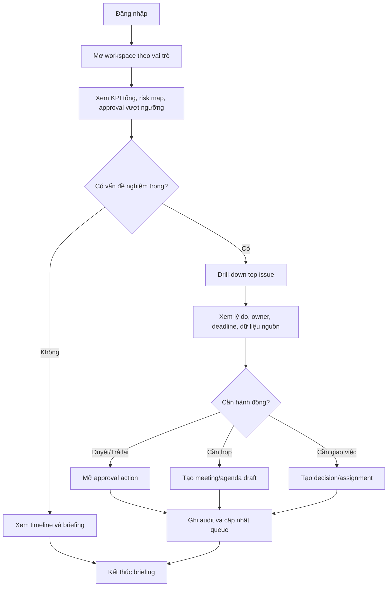
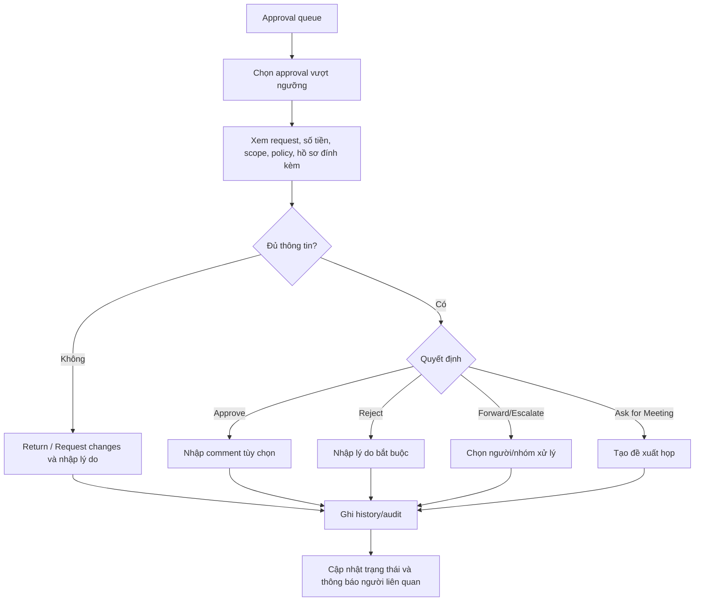
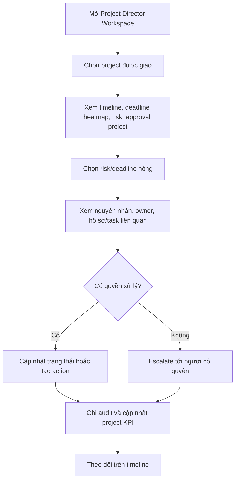
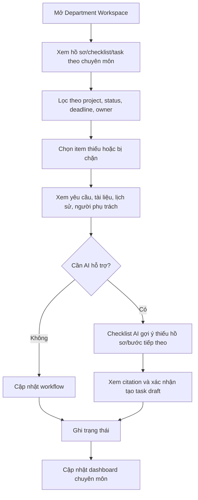
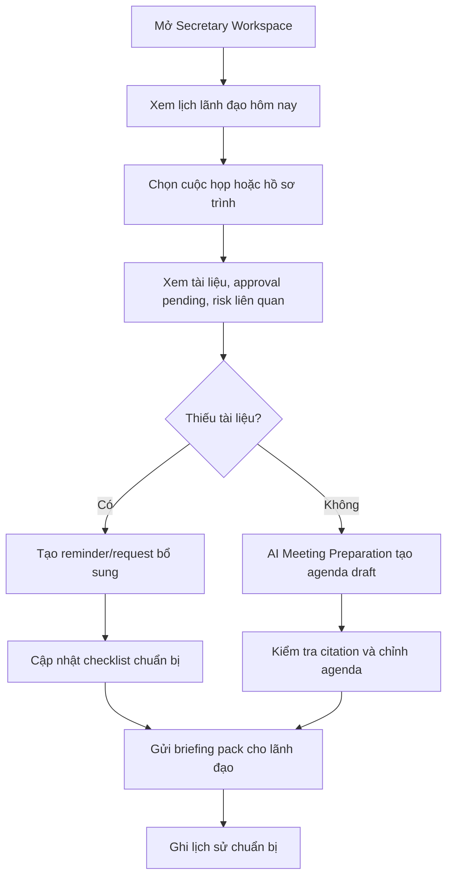

# User Journey Flows

## 1. Chairman / CEO Morning Command Loop

Mục tiêu: lãnh đạo mở workspace và trong 1-2 phút biết việc nào cần xử lý trước.

## 2. Approval Vượt Ngưỡng

Mục tiêu: người có thẩm quyền xử lý approval quan trọng với đủ ngữ cảnh, lý do và audit.

## 3. Project Director Risk / Deadline Flow

Mục tiêu: Giám đốc dự án nhìn được project đang kẹt ở đâu và xử lý đúng người đúng hạn.

## 4. Department Head Checklist / Workflow Flow

Mục tiêu: trưởng bộ phận quản được hồ sơ, checklist, approval chuyên môn và risk chuyên môn.

## 5. Secretary / Assistant Meeting Preparation Flow

Mục tiêu: thư ký/trợ lý chuẩn bị lịch, hồ sơ trình, agenda và summary trong phạm vi được ủy quyền.

## Journey Patterns

Các pattern cần chuẩn hóa:

- Entry theo workspace vai trò, không bắt người dùng tự chọn từ dashboard chung.
- Mọi journey bắt đầu bằng priority queue hoặc dashboard theo scope.
- Drill-down luôn hiển thị lý do, owner, deadline, trạng thái, dữ liệu nguồn và action khả dụng.
- Mutation quan trọng luôn có confirmation, validation và audit/history.
- AI luôn ở trạng thái draft/gợi ý, có citation và cần người dùng xác nhận.

## Flow Optimization Principles

- Đưa việc khẩn lên trước, nhưng vẫn cho người dùng kiểm chứng nguồn.
- Giảm số bước từ dashboard tới action chính.
- Không yêu cầu lãnh đạo xử lý task nhỏ hoặc dữ liệu chuyên môn sâu mặc định.
- Không hiển thị action người dùng không có quyền.
- Khi thiếu quyền, giải thích rõ và gợi ý người/nhóm có thể xử lý.
- Sau mỗi action, cập nhật queue/timeline để người dùng thấy hệ thống đã ghi nhận.
