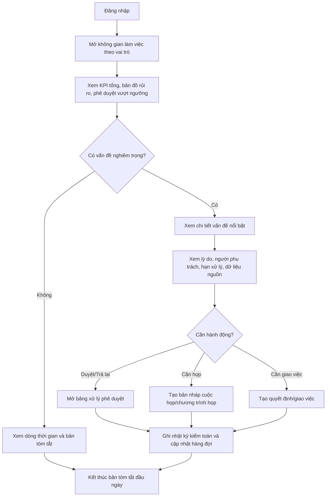
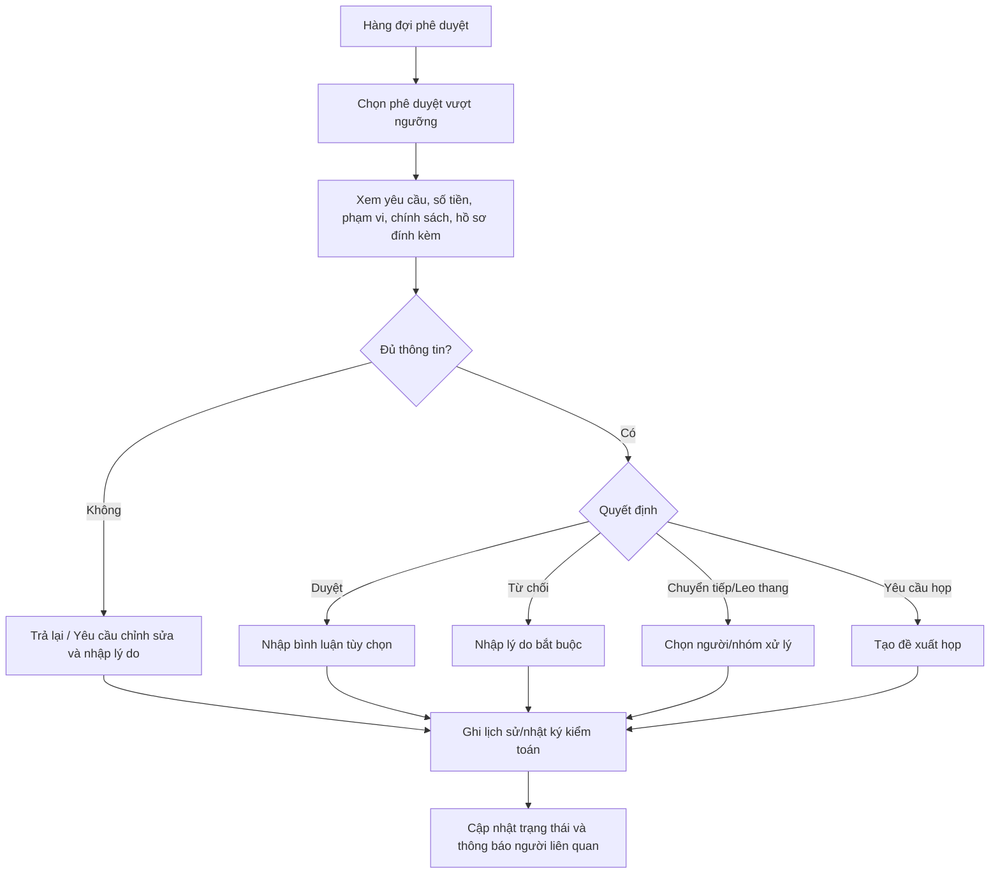
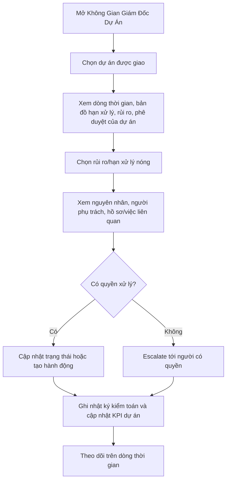
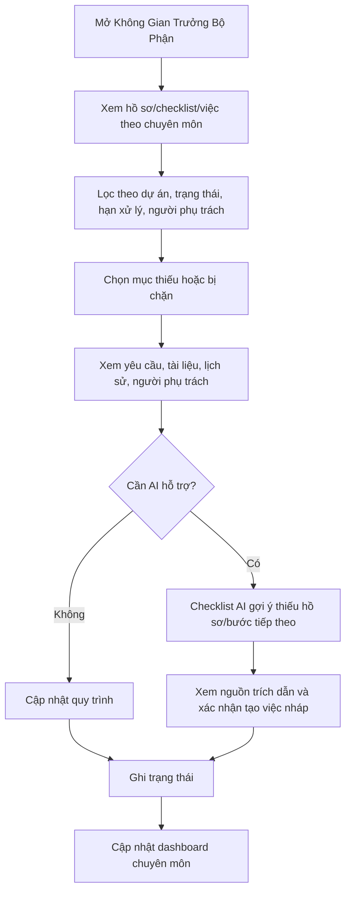
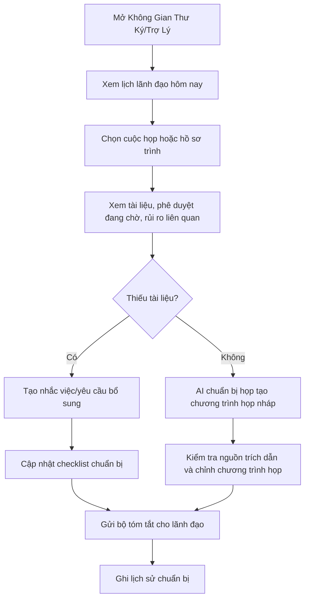

# Luồng Trải Nghiệm Người Dùng

## 1. Luồng Điều Hành Đầu Ngày Của Chủ Tịch / Tổng Giám Đốc

Mục tiêu: lãnh đạo mở không gian làm việc và trong 1-2 phút biết việc nào cần xử lý trước.

## 2. Approval Vượt Ngưỡng

Mục tiêu: người có thẩm quyền xử lý phê duyệt quan trọng với đủ ngữ cảnh, lý do và nhật ký kiểm toán.

## 3. Luồng Rủi Ro / Hạn Xử Lý Của Giám Đốc Dự Án

Mục tiêu: Giám đốc dự án nhìn được dự án đang kẹt ở đâu và xử lý đúng người đúng hạn.

## 4. Luồng Checklist / Quy Trình Của Trưởng Bộ Phận

Mục tiêu: Trưởng bộ phận quản được hồ sơ, checklist, phê duyệt chuyên môn và rủi ro chuyên môn.

## 5. Luồng Chuẩn Bị Họp Của Thư Ký / Trợ Lý

Mục tiêu: Thư ký/Trợ lý chuẩn bị lịch, hồ sơ trình, chương trình họp và tóm tắt trong phạm vi được ủy quyền.

## Pattern Luồng Cần Chuẩn Hóa

Các pattern cần chuẩn hóa:

- Điểm vào theo không gian làm việc vai trò, không bắt người dùng tự chọn từ dashboard chung.
- Mọi luồng bắt đầu bằng hàng đợi ưu tiên hoặc dashboard theo phạm vi.
- Xem chi tiết luôn hiển thị lý do, người phụ trách, hạn xử lý, trạng thái, dữ liệu nguồn và hành động khả dụng.
- Thay đổi dữ liệu quan trọng luôn có xác nhận, kiểm tra hợp lệ và lịch sử/nhật ký kiểm toán.
- AI luôn ở trạng thái bản nháp/gợi ý, có nguồn trích dẫn và cần người dùng xác nhận.

## Nguyên Tắc Tối Ưu Luồng

- Đưa việc khẩn lên trước, nhưng vẫn cho người dùng kiểm chứng nguồn.
- Giảm số bước từ dashboard tới hành động chính.
- Không yêu cầu lãnh đạo xử lý việc nhỏ hoặc dữ liệu chuyên môn sâu mặc định.
- Không hiển thị hành động người dùng không có quyền.
- Khi thiếu quyền, giải thích rõ và gợi ý người/nhóm có thể xử lý.
- Sau mỗi hành động, cập nhật hàng đợi/dòng thời gian để người dùng thấy hệ thống đã ghi nhận.
