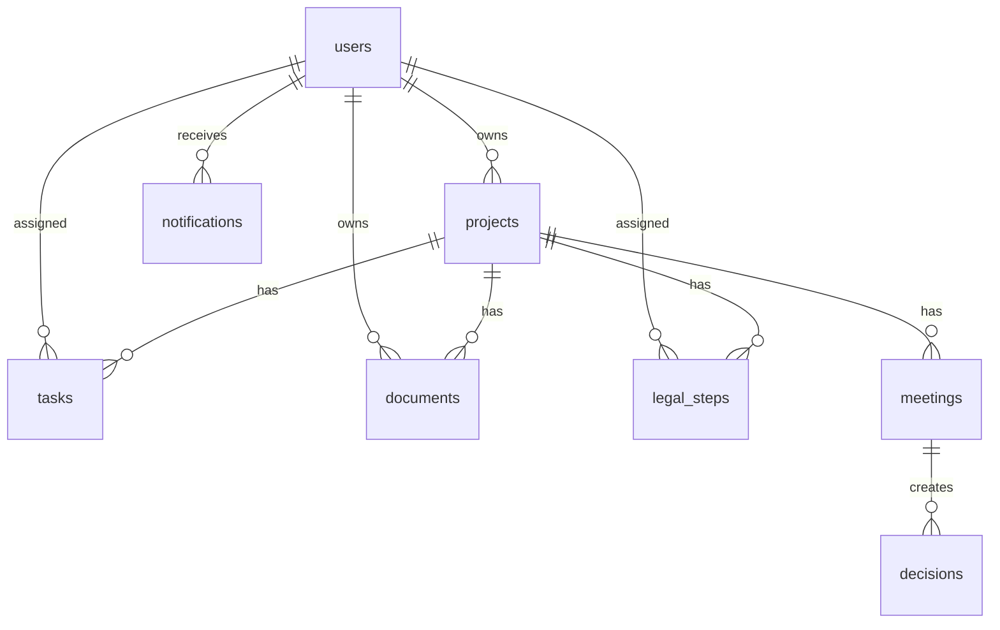

# GreenNest BuildFlow - System Architecture

> Documentation status: MVP implementation architecture snapshot. For finalized architecture overview, use `docs/architecture/ARCHITECTURE_OVERVIEW.md`. For scalable platform architecture, use `blueprint/02-scalable-architecture.md`. For AI Assistant/RAG strategy, use `blueprint/14-ai-assistant-strategy.md`.

Phiên bản: 1.0  
Ngày lập: 16/05/2026  
Mục tiêu: mô tả kiến trúc kỹ thuật để Codex/Claude triển khai MVP V1 có cấu trúc rõ, dễ mở rộng sang các sprint sau.

## 1. Recommended Stack

| Lớp | Công nghệ | Lý do |
| --- | --- | --- |
| Frontend | Next.js + TypeScript | Web app hiện đại, dễ mở rộng, route rõ |
| UI | Tailwind CSS + shadcn/ui | Build nhanh, component nhất quán |
| Backend | Supabase hoặc Next.js API routes | MVP nhanh, giảm vận hành backend |
| Database | PostgreSQL | Phù hợp dữ liệu quan hệ dự án, task, hồ sơ, phân quyền |
| Auth | Supabase Auth hoặc NextAuth | Đăng nhập, mời người dùng, phân quyền |
| Storage | Supabase Storage hoặc S3 | Lưu hồ sơ, bản vẽ, tài liệu |
| Validation | Zod | Kiểm soát input và type-safe validation |
| ORM | Prisma nếu dùng backend riêng | Schema rõ, migration dễ quản lý |
| Deploy | Vercel + Supabase | Phù hợp MVP |

Khuyến nghị MVP: Next.js App Router + TypeScript + Tailwind + Supabase. Nếu chưa cấu hình Supabase ngay, dùng service layer với mock data có cấu trúc để dễ thay bằng database.

## 2. Architecture Principles

- Mọi dữ liệu nghiệp vụ chính đi qua service/repository layer, không gọi database rải rác trong component.
- Component chỉ render UI và gọi hooks/actions.
- Constants nghiệp vụ đặt tập trung trong `constants/`.
- Types đặt trong `types/` hoặc gần module nếu chỉ dùng nội bộ.
- Validation schema đặt cạnh feature hoặc trong `lib/validation`.
- Dashboard tính toán từ query/service, không hardcode số liệu trong UI.
- RBAC kiểm tra ở cả UI guard và API/server action.
- Entity chính chuẩn bị audit log.

## 3. Target Folder Structure

```text
app/
  (auth)/
    login/
  (dashboard)/
    dashboard/
    projects/
    tasks/
    documents/
    legal/
    meetings/
    users/
    settings/
components/
  layout/
  ui/
  shared/
modules/
  dashboard/
    components/
    services/
    types.ts
  projects/
    components/
    services/
    types.ts
  tasks/
    components/
    services/
    types.ts
  documents/
    components/
    services/
    types.ts
  legal/
    components/
    services/
    types.ts
  users/
    components/
    services/
    types.ts
lib/
  auth/
  db/
  storage/
  validation/
  permissions/
services/
  audit-log-service.ts
  notification-service.ts
types/
  common.ts
constants/
  statuses.ts
  roles.ts
  legal-steps.ts
hooks/
database/
  schema.sql
  seed.sql
  migrations/
docs/
tests/
```

## 4. Domain Model

### Core Entities

- User: người dùng hệ thống.
- Project: thực thể trung tâm.
- Task: công việc gắn với dự án.
- Document: hồ sơ/file/link gắn với dự án.
- LegalStep: bước pháp lý gắn với dự án.
- Meeting: cuộc họp theo dự án.
- Decision: quyết định/action item từ meeting.
- Notification: thông báo/cảnh báo.
- AuditLog: lịch sử thay đổi.

### Relationships



## 5. Database Schema V1

### users

| Field | Type | Notes |
| --- | --- | --- |
| id | uuid | primary key |
| full_name | text | required |
| email | text | unique, required |
| avatar_url | text | nullable |
| role | text | legacy/default role key; scalable access should use roles and memberships |
| created_at | timestamptz | required |
| updated_at | timestamptz | required |

### projects

| Field | Type | Notes |
| --- | --- | --- |
| id | uuid | primary key |
| code | text | unique |
| name | text | required |
| location | text | nullable |
| area | numeric | nullable |
| project_type | text | nullable |
| investor | text | nullable |
| status | text | required |
| owner_id | uuid | references users |
| created_at | timestamptz | required |
| updated_at | timestamptz | required |
| archived_at | timestamptz | nullable |

### tasks

| Field | Type | Notes |
| --- | --- | --- |
| id | uuid | primary key |
| project_id | uuid | references projects |
| title | text | required |
| description | text | nullable |
| assignee_id | uuid | references users, nullable |
| due_date | date | nullable |
| status | text | required |
| priority | text | required |
| category | text | nullable |
| created_at | timestamptz | required |
| updated_at | timestamptz | required |

### documents

| Field | Type | Notes |
| --- | --- | --- |
| id | uuid | primary key |
| project_id | uuid | references projects |
| title | text | required |
| doc_type | text | required |
| file_url | text | nullable |
| external_url | text | nullable |
| version | text | required |
| status | text | required |
| owner_id | uuid | references users, nullable |
| updated_at | timestamptz | required |
| created_at | timestamptz | required |

### legal_steps

| Field | Type | Notes |
| --- | --- | --- |
| id | uuid | primary key |
| project_id | uuid | references projects |
| step_code | text | required |
| step_name | text | required |
| status | text | required |
| assignee_id | uuid | references users, nullable |
| due_date | date | nullable |
| completed_date | date | nullable |
| notes | text | nullable |
| created_at | timestamptz | required |
| updated_at | timestamptz | required |

### meetings

| Field | Type | Notes |
| --- | --- | --- |
| id | uuid | primary key |
| project_id | uuid | references projects |
| title | text | required |
| meeting_date | timestamptz | required |
| summary | text | nullable |
| created_by | uuid | references users |
| created_at | timestamptz | required |
| updated_at | timestamptz | required |

### decisions

| Field | Type | Notes |
| --- | --- | --- |
| id | uuid | primary key |
| meeting_id | uuid | references meetings, nullable |
| project_id | uuid | references projects |
| decision_text | text | required |
| owner_id | uuid | references users, nullable |
| due_date | date | nullable |
| status | text | required |
| created_at | timestamptz | required |
| updated_at | timestamptz | required |

### notifications

| Field | Type | Notes |
| --- | --- | --- |
| id | uuid | primary key |
| user_id | uuid | references users |
| project_id | uuid | references projects, nullable |
| type | text | required |
| message | text | required |
| is_read | boolean | default false |
| created_at | timestamptz | required |

### audit_logs

| Field | Type | Notes |
| --- | --- | --- |
| id | uuid | primary key |
| actor_id | uuid | references users |
| entity_type | text | required |
| entity_id | uuid | required |
| action | text | required |
| old_value | jsonb | nullable |
| new_value | jsonb | nullable |
| created_at | timestamptz | required |

## 6. Constants and Enums

Use stable keys internally and Vietnamese labels in UI.

Project status:

- `planning`: Đang chuẩn bị.
- `active`: Đang triển khai.
- `paused`: Tạm dừng.
- `completed`: Hoàn thành.
- `archived`: Lưu trữ.

Task status:

- `todo`: Chưa bắt đầu.
- `in_progress`: Đang làm.
- `waiting`: Đang chờ.
- `done`: Đã xong.
- `blocked`: Bị vướng.

Priority:

- `low`: Thấp.
- `medium`: Trung bình.
- `high`: Cao.
- `urgent`: Khẩn cấp.

Document status:

- `missing`: Thiếu.
- `draft`: Bản nháp.
- `in_review`: Đang kiểm tra.
- `complete`: Đủ.
- `needs_update`: Cần bổ sung.

Legal status:

- `not_started`: Chưa bắt đầu.
- `in_progress`: Đang làm.
- `waiting_authority`: Chờ cơ quan.
- `done`: Đã xong.
- `blocked`: Bị vướng.

Roles:

Use scalable role keys from `blueprint/12-auth-roles-permissions.md`, including:

- `admin`.
- `tong_giam_doc`.
- `pho_tong_giam_doc`.
- `giam_doc_du_an`.
- `quan_ly_du_an`.
- `to_truong`.
- `phap_ly`.
- `ke_toan`.
- `thiet_ke`.
- `ky_thuat`.
- `thi_cong`.
- `thu_ky_tro_ly`.
- `viewer`.

## 7. Auth and Permission Model

Use the scalable RBAC model in `blueprint/12-auth-roles-permissions.md`.

Core concepts:

- Supabase Auth handles identity and sessions.
- App database stores profile, system role, workspace membership and project membership.
- Permission checks use action keys, not scattered role-name checks.
- Deny by default.
- Role changes must be audited.

Recommended tables:

- `roles`.
- `permissions`.
- `role_permissions`.
- `workspaces`.
- `workspace_members`.
- `project_members`.

Implementation:

- Define `can(user, action, resource)` in `lib/permissions`.
- UI hides unavailable actions.
- API/server action still enforces permission.
- Sidebar and default dashboard are derived from resolved permissions.

## 8. Service Layer Contract

Projects:

- `listProjects(filters)`.
- `getProject(projectId)`.
- `createProject(input)`.
- `updateProject(projectId, input)`.
- `archiveProject(projectId)`.
- `initializeLegalChecklist(projectId)`.

Tasks:

- `listTasks(filters)`.
- `getTask(taskId)`.
- `createTask(input)`.
- `updateTask(taskId, input)`.
- `getOverdueTasks(filters)`.
- `getUpcomingTasks(filters)`.

Documents:

- `listDocuments(filters)`.
- `createDocument(input)`.
- `updateDocument(documentId, input)`.
- `getMissingDocuments(filters)`.

Legal:

- `listLegalSteps(projectId)`.
- `updateLegalStep(stepId, input)`.
- `getBlockedLegalSteps(filters)`.

Dashboard:

- `getDashboardSummary(userContext)`.
- `getProjectDashboard(projectId)`.

## 9. Dashboard Metrics

Minimum metrics:

- `totalProjects`: count active/non-archived projects.
- `overdueTasks`: tasks where `due_date < today` and status not done.
- `missingDocuments`: documents where status is missing or needs_update.
- `blockedLegalSteps`: legal steps where status is blocked.
- `overallProgress`: derived from done tasks and done legal steps, formula can evolve.

Do not calculate these directly inside presentational components.

## 10. Data Flow

```text
UI Component
  -> Hook or Server Action
  -> Service Layer
  -> Repository/DB Client
  -> Database/Storage
  -> Service returns typed DTO
  -> UI renders Vietnamese labels
```

For MVP mock phase:

```text
UI Component
  -> Hook
  -> Service Layer
  -> Structured mock repository
```

The service API must remain close enough to swap mock repository with Supabase/PostgreSQL.

## 11. Security

- All app routes require authenticated user except login.
- Server actions/API routes must check user session.
- Mutations must check role permission.
- File upload must validate size/type.
- Document URLs should not expose private storage without signed URL if using private bucket.
- Audit important mutations: project create/update/archive, task update, document update, legal step update, user role change.

## 12. Testing Strategy

Minimum tests:

- Unit tests for constants, permission rules, status helpers and dashboard metric calculation.
- Service tests for project creation and legal checklist initialization.
- Component smoke tests for key screens if test framework is available.
- E2E happy path:
  - Login.
  - Create project.
  - Create task.
  - Add document.
  - Update legal step.
  - Confirm dashboard updates.

## 13. Deployment Architecture

MVP target:

```text
Browser
  -> Vercel Next.js App
  -> Supabase Auth
  -> Supabase PostgreSQL
  -> Supabase Storage
```

Environment variables:

- `NEXT_PUBLIC_SUPABASE_URL`.
- `NEXT_PUBLIC_SUPABASE_ANON_KEY`.
- `SUPABASE_SERVICE_ROLE_KEY` only on server if needed.
- `DATABASE_URL` if Prisma is used.

## 14. Agent Implementation Rules

- Do not rename product, modules, workflows or schema core without explicit request.
- Build sprint by sprint.
- Before implementing a module, update or confirm types, constants, service contract and acceptance criteria.
- Keep UI labels in Vietnamese.
- Put status values in constants, never copy strings across components.
- Prefer typed DTOs and Zod validation for user input.
- Keep file edits scoped to the current sprint.
- Report changed files, how to run, and remaining gaps after each sprint.
