# 09 - Data Model

## 1. Purpose

This document defines a scalable logical data model for GreenNest BuildFlow. It complements `03-data-blueprint.md` with more implementation-oriented entity fields and relationships.

## 2. Entity Relationship Overview

```mermaid
erDiagram
  users ||--o{ project_members : joins
  users ||--o{ workspace_members : joins
  roles ||--o{ role_permissions : grants
  permissions ||--o{ role_permissions : included
  projects ||--o{ project_members : has
  projects ||--o{ tasks : has
  projects ||--o{ documents : has
  documents ||--o{ document_versions : has
  projects ||--o{ legal_steps : has
  legal_steps ||--o{ legal_submissions : has
  projects ||--o{ meetings : has
  meetings ||--o{ decisions : has
  projects ||--o{ risks : has
  projects ||--o{ design_packages : has
  projects ||--o{ construction_packages : has
  projects ||--o{ budgets : has
  projects ||--o{ contracts : has
  contracts ||--o{ payment_requests : has
  projects ||--o{ proposals : has
  proposals ||--o{ proposal_steps : routes
  proposals ||--o{ proposal_comments : discusses
  proposals ||--o{ proposal_attachments : includes
  proposals ||--o{ proposal_links : links
  proposals ||--o{ proposal_decisions : records
  users ||--o{ ai_interactions : requests
  ai_interactions ||--o{ ai_jobs : queues
  ai_interactions ||--o{ ai_citations : cites
  ai_interactions ||--o{ ai_action_proposals : proposes
  users ||--o{ source_registry_entries : manages
  users ||--o{ audit_logs : performs
```

## 3. MVP Core Tables

### users

- id.
- full_name.
- email.
- avatar_url.
- role.
- created_at.
- updated_at.

`role` may remain for MVP compatibility. Scalable implementation should resolve access through `roles`, `workspace_members` and `project_members`.

### roles

- id.
- key.
- label_vi.
- description.
- scope: system, workspace, project, external.
- is_active.
- created_at.
- updated_at.

### permissions

- id.
- key.
- description.
- module.
- created_at.

### role_permissions

- id.
- role_id.
- permission_id.

See `12-auth-roles-permissions.md` for role and permission keys.

### projects

- id.
- code.
- name.
- location.
- area.
- project_type.
- investor.
- status.
- owner_id.
- created_by.
- created_at.
- updated_at.
- archived_at.

### tasks

- id.
- project_id.
- title.
- description.
- assignee_id.
- due_date.
- status.
- priority.
- category.
- linked_entity_type.
- linked_entity_id.
- created_by.
- created_at.
- updated_at.
- archived_at.

### documents

- id.
- project_id.
- title.
- doc_type.
- current_version_id.
- status.
- owner_id.
- created_by.
- created_at.
- updated_at.
- archived_at.

### document_versions

- id.
- document_id.
- version.
- file_url.
- external_url.
- uploaded_by.
- uploaded_at.
- notes.

### legal_steps

- id.
- project_id.
- step_code.
- step_name.
- status.
- assignee_id.
- due_date.
- completed_date.
- notes.
- order_index.
- created_at.
- updated_at.

### meetings

- id.
- project_id.
- title.
- meeting_date.
- summary.
- created_by.
- created_at.
- updated_at.

### decisions

- id.
- meeting_id.
- project_id.
- decision_text.
- owner_id.
- due_date.
- status.
- created_at.
- updated_at.

### notifications

- id.
- user_id.
- project_id.
- type.
- message.
- is_read.
- created_at.

### audit_logs

- id.
- actor_id.
- entity_type.
- entity_id.
- action.
- old_value.
- new_value.
- created_at.

## 4. Knowledge and External Source Governance Tables

These tables control what can become authoritative RAG context. External search results are discovery inputs only until reviewed and approved.

### source_registry_entries

- id.
- domain.
- source_category: government, standards, internal, market, reference.
- module.
- source_type.
- confidence.
- tags.
- enabled.
- notes.
- created_by.
- updated_by.
- created_at.
- updated_at.

Rules:

- BO settings users manage these entries.
- Knowledge/Web Search intake can import only URLs whose hostname matches an enabled source registry domain or subdomain.
- Changing source registry settings does not auto-approve or auto-index any source.

### external_search_logs

- id.
- user_id.
- query.
- provider.
- provider_metadata.
- result_count.
- created_at.

Rules:

- Logs prove discovery activity, not source authority.
- Search results become `knowledge_candidates` only after explicit import.

### knowledge_discovery_topics

- id.
- module.
- query.
- enabled.
- frequency: manual, daily, weekly.
- owner_id.
- reviewer_id.
- last_run_at.
- last_run_status: never_run, succeeded, partial, failed.
- retry_count.
- max_retries.
- next_retry_at.
- error_code.
- error_message.
- locked_at.
- locked_by.
- created_by.
- updated_by.
- created_at.
- updated_at.

Rules:

- Topics are managed by users with `settings.manage` or `knowledge.manage_source_registry`.
- The current implementation supports manual Run Now and a manual scheduler entrypoint for due enabled daily/weekly topics.
- `locked_at` and `locked_by` are soft locks used by scheduler runners to prevent duplicate concurrent execution.
- Failed scheduled runs update retry metadata and can be retried after `next_retry_at` until `max_retries` is reached.
- Hosted cron infrastructure is outside the table model; Vercel Cron, GitHub Actions or server cron can invoke the scheduler entrypoint.
- A topic never writes directly to Knowledge Items or the RAG index.

### knowledge_discovery_run_logs

- id.
- topic_id.
- run_by.
- query.
- provider.
- provider_metadata.
- status: succeeded, partial, failed.
- result_count.
- imported_count.
- skipped_duplicate_count.
- skipped_disallowed_count.
- retry_count.
- max_retries.
- next_retry_at.
- error_code.
- error_message.
- started_at.
- finished_at.

Rules:

- Run logs record search provider activity, import counts and skipped counts.
- Failed run logs record retry/error metadata for audit.
- Run Now imports only allowlisted, non-duplicate results as `knowledge_candidates.pending_review`.
- Skipped disallowed and duplicate results remain outside Knowledge Center and RAG.

### knowledge_candidates

- id.
- source_type.
- source_ref_id.
- module.
- title.
- extracted_text.
- submitted_by.
- status.
- promoted_knowledge_item_id.
- reviewed_by.
- reviewed_at.
- notes.
- created_at.
- updated_at.

Rules:

- Web search imports enter as `pending_review`.
- Candidates are not RAG-eligible.
- Approval/promote creates or links to a governed Knowledge Item.

### knowledge_items and knowledge_chunks

- Knowledge Items hold reviewed source metadata and lifecycle status.
- Only approved Knowledge Items can become RAG-eligible.
- Knowledge Chunks hold approved-only retrieval text, citation metadata and optional embedding metadata.

## 5. Enterprise Governance and Proposal Tables

These tables support internal proposal, review and approval workflows across investment, legal, finance, contract, design, construction, HR, QA/QC and safety modules.

### proposals

- id.
- code.
- title.
- type: investment, legal, document, finance, contract, procurement, design, construction, hr, quality, safety, general.
- project_id nullable.
- module.
- requested_by.
- owner_id.
- current_step_id nullable.
- status: draft, submitted, in_review, change_requested, approved, rejected, archived.
- priority.
- amount nullable.
- due_date nullable.
- summary.
- ai_review_status: not_checked, checked, warning, blocked.
- ai_review_summary nullable.
- created_at.
- updated_at.
- archived_at.

Rules:

- A proposal is the canonical internal decision object.
- A proposal can link to project, task, document, legal step, meeting, report, contract, payment request or investment opportunity records.
- Approval status does not directly mutate linked records unless a domain-specific accepted action executes through the normal service path.
- AI can review and summarize proposals but cannot approve them.

### proposal_steps

- id.
- proposal_id.
- step_order.
- approver_role nullable.
- approver_user_id nullable.
- status: pending, in_review, approved, rejected, change_requested, skipped.
- decided_by nullable.
- decided_at nullable.
- decision_notes nullable.
- created_at.
- updated_at.

### proposal_comments

- id.
- proposal_id.
- author_id.
- body.
- visibility: internal, requester, external_limited.
- created_at.
- updated_at.

### proposal_attachments

- id.
- proposal_id.
- document_id nullable.
- file_url nullable.
- external_url nullable.
- title.
- uploaded_by.
- created_at.

### proposal_links

- id.
- proposal_id.
- entity_type.
- entity_id.
- relation_type: evidence, source, output, dependency, generated_action.
- created_at.

### proposal_decisions

- id.
- proposal_id.
- step_id nullable.
- decision: approved, rejected, change_requested, escalated.
- decided_by.
- decided_at.
- notes.
- created_at.

## 6. AI Distributed Processing Tables

These tables support AI Gateway, streaming responses, background jobs, citations and human-confirmed action proposals. They do not grant permissions by themselves; every read/mutation still uses the RBAC and access-scope model.

### ai_interactions

- id.
- requested_by.
- workspace_id.
- project_id nullable.
- module.
- intent.
- mode: streaming, background.
- prompt_summary.
- request_payload_ref nullable.
- response_summary.
- response_text nullable.
- model_provider.
- model_name.
- status: pending, streaming, queued, running, succeeded, failed, cancelled.
- scope_summary.
- created_at.
- updated_at.
- completed_at.

Rules:

- One user request creates one interaction.
- Streaming mode may complete without an `ai_jobs` record.
- Background mode must create an `ai_jobs` record.
- Interaction content is not Knowledge Center content unless explicitly submitted as Knowledge Candidate.

### ai_jobs

- id.
- interaction_id.
- requested_by.
- workspace_id.
- project_id nullable.
- module.
- intent.
- mode: streaming, background.
- priority: low, normal, high, urgent.
- status: queued, running, succeeded, failed, cancelled, expired.
- scope_snapshot.
- rate_limit_key.
- payload_ref.
- result_ref.
- retry_count.
- max_retries.
- error_code.
- error_message.
- locked_by.
- locked_at.
- started_at.
- finished_at.
- created_at.
- updated_at.

Rules:

- Workers must re-check live permission/scope before processing.
- `scope_snapshot` is for audit and reproducibility only.
- Jobs should expire if not processed within the configured business window.
- Queue selection should consider priority while preserving workspace/project fairness.

### ai_citations

- id.
- interaction_id.
- job_id nullable.
- citation_type: internal_record, knowledge_item, knowledge_chunk, external_candidate_review_only.
- entity_type.
- entity_id.
- knowledge_item_id nullable.
- knowledge_chunk_id nullable.
- title.
- source_url nullable.
- module.
- project_id nullable.
- access_level.
- created_at.

Rules:

- Citations must be scoped to what the user could access at response time.
- Authoritative answers cite only internal records and approved Knowledge Center items/chunks.
- External candidates can be cited only in review-mode outputs and must be labeled unapproved.

### ai_action_proposals

- id.
- interaction_id.
- job_id nullable.
- proposed_by_ai.
- requested_by.
- project_id nullable.
- module.
- action_key.
- target_entity_type.
- target_entity_id nullable.
- proposed_payload.
- rationale.
- required_permission.
- status: proposed, accepted, rejected, expired, executed, failed.
- decided_by nullable.
- decided_at nullable.
- decision_notes nullable.
- reviewed_by nullable, legacy alias if already implemented.
- reviewed_at nullable, legacy alias if already implemented.
- executed_at nullable.
- executed_entity_type nullable.
- executed_entity_id nullable.
- execution_result.
- error_message nullable.
- created_at.
- updated_at.

Rules:

- Proposals do not mutate domain data by themselves.
- Accepting a proposal must call the normal domain API/server action.
- The accept path must re-check user permission and resource scope.
- Rejected and expired proposals remain auditable.
- Proposal payload should remain available for audit after execution.
- Execution metadata should identify the real domain entity created or updated.
- Supported initial action keys are `create_task`, `request_document_update`, `create_legal_followup_task`, `update_legal_note` and `create_meeting_action_item`.

## 7. Scalable Tables After MVP

### workspaces

- id.
- name.
- slug.
- owner_id.
- created_at.
- updated_at.

### workspace_members

- id.
- workspace_id.
- user_id.
- role.
- role_id.
- created_at.

### project_members

- id.
- project_id.
- user_id.
- role.
- role_id.
- created_at.

### legal_checklist_templates

- id.
- name.
- project_type.
- province.
- is_active.
- created_at.
- updated_at.

### legal_step_templates

- id.
- template_id.
- step_code.
- step_name.
- order_index.
- default_due_offset_days.
- required_document_type_ids.

### legal_submissions

- id.
- project_id.
- legal_step_id.
- submitted_date.
- authority_name.
- status.
- response_due_date.
- notes.

### authority_responses

- id.
- legal_submission_id.
- response_date.
- response_type.
- summary.
- document_id.

### risks

- id.
- project_id.
- title.
- description.
- source_type.
- source_id.
- severity.
- probability.
- status.
- owner_id.
- due_date.
- created_at.
- updated_at.

### design_packages

- id.
- project_id.
- name.
- discipline.
- status.
- owner_id.
- due_date.
- created_at.
- updated_at.

### drawings

- id.
- project_id.
- design_package_id.
- document_id.
- drawing_code.
- title.
- revision.
- status.
- created_at.
- updated_at.

### construction_packages

- id.
- project_id.
- name.
- contractor_id.
- status.
- planned_start.
- planned_finish.
- actual_start.
- actual_finish.
- progress_percent.

### contractors

- id.
- name.
- tax_code.
- contact_name.
- contact_phone.
- contact_email.
- status.

### contracts

- id.
- project_id.
- contractor_id.
- contract_code.
- title.
- contract_value.
- status.
- signed_date.
- start_date.
- end_date.

### budgets

- id.
- project_id.
- name.
- version.
- status.
- approved_at.
- created_at.

### budget_lines

- id.
- budget_id.
- category.
- description.
- planned_amount.
- committed_amount.
- actual_amount.

### payment_requests

- id.
- project_id.
- contract_id.
- amount.
- status.
- requested_by.
- requested_at.
- approved_at.
- paid_at.

### investment_opportunities

- id.
- code.
- title.
- location.
- land_area.
- source.
- status.
- owner_id.
- estimated_investment.
- risk_summary.
- created_at.
- updated_at.
- archived_at.

### hr_requests

- id.
- requester_id.
- type.
- title.
- status.
- linked_proposal_id.
- created_at.
- updated_at.

### quality_checks

- id.
- project_id.
- construction_package_id.
- title.
- status.
- inspector_id.
- checked_at.
- linked_proposal_id.

### safety_observations

- id.
- project_id.
- construction_package_id.
- title.
- severity.
- status.
- reported_by.
- corrective_action_due_date.
- linked_proposal_id.

## 8. Relationship Rules

- A project can have many tasks, documents, legal steps, meetings, risks, design packages, construction packages, contracts and budgets.
- A project can have many proposals, and proposals may also exist without a project during early investment or HR/admin workflows.
- A proposal can have many steps, comments, attachments, links and decisions.
- A proposal can link to many existing records through `proposal_links`.
- A document can have many versions.
- A legal step can link to many documents through a relation table if needed.
- A meeting can create many decisions.
- A decision can create a task.
- A contract can have many payment requests.
- A budget can have many budget lines.
- An AI interaction can create zero or more background jobs.
- An AI interaction can have many citations.
- An AI interaction can have many action proposals.
- An AI action proposal can execute only through the normal domain mutation path.
- Source registry entries gate external source import before Knowledge Candidate review.
- External search logs do not imply Knowledge approval or RAG eligibility.

## 9. Relation Tables To Add When Needed

- `legal_step_documents`.
- `task_documents`.
- `meeting_documents`.
- `contract_documents`.
- `risk_tasks`.
- `project_tags`.
- `user_notification_preferences`.

## 10. Data Retention Rules

- Main business records should be archived, not deleted.
- Proposals, proposal steps and proposal decisions should be retained for audit even if linked records are archived.
- Audit logs should not be edited by normal application workflows.
- Document versions should remain immutable after upload except metadata corrections by admin.
- Report snapshots should be preserved.
- AI interactions, jobs, citations and action proposals should be retained long enough for audit, dispute review and prompt/debug analysis under company privacy policy.
- Raw prompts and full responses should be minimized or stored by reference when sensitive project, finance, legal or external-user data is involved.
